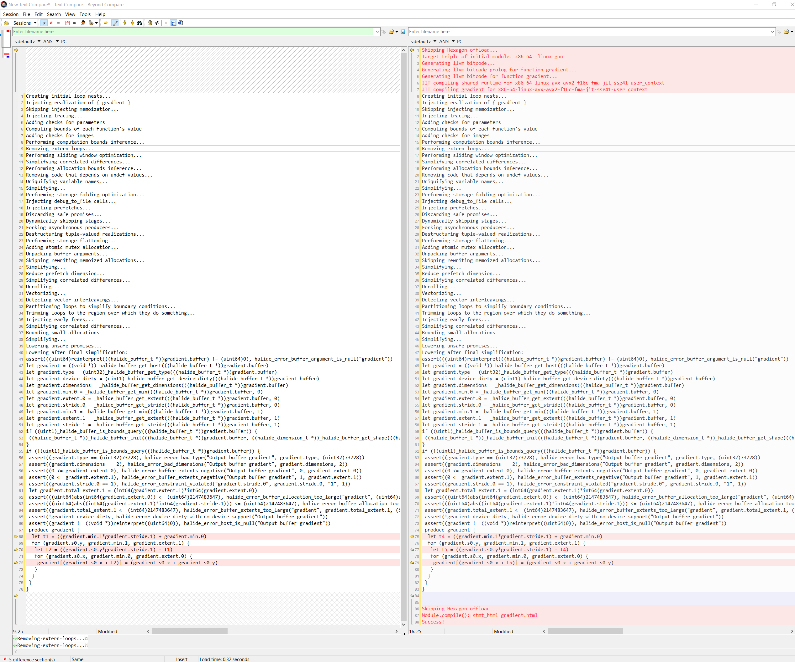
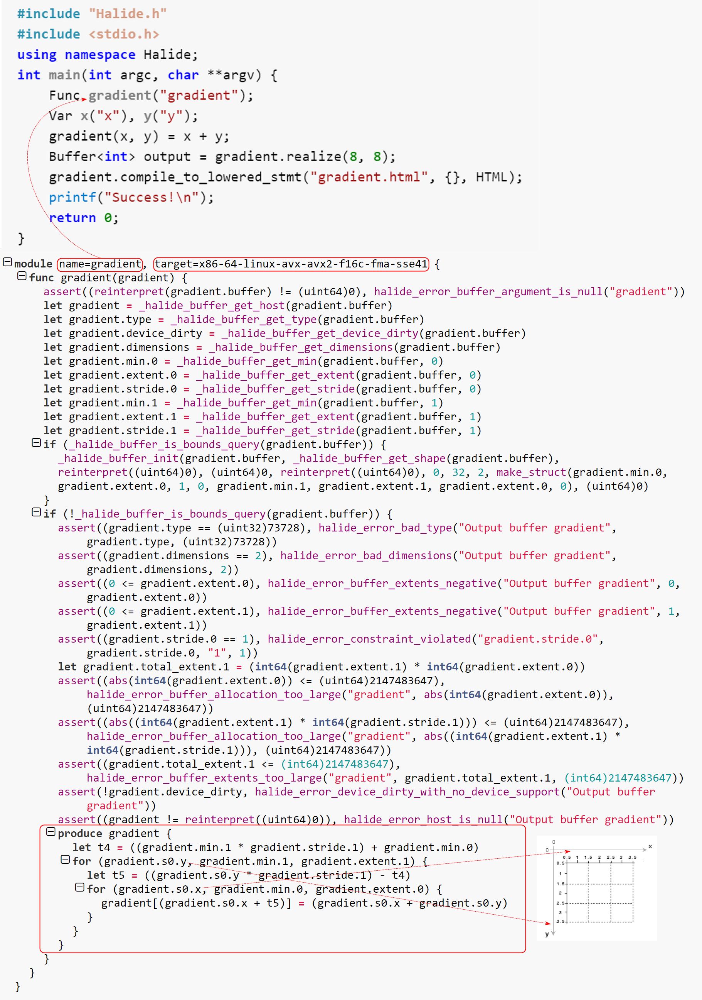

# lesson 3: Inspecting the generated code

## Code

```c
#include "Halide.h"
#include <stdio.h>

// This time we'll just import the entire Halide namespace
using namespace Halide;

int main(int argc, char **argv) {

    // We'll start by defining the simple single-stage imaging
    // pipeline from lesson 1.

    // This lesson will be about debugging, but unfortunately in C++,
    // objects don't know their own names, which makes it hard for us
    // to understand the generated code. To get around this, you can
    // pass a string to the Func and Var constructors to give them a
    // name for debugging purposes.
    Func gradient("gradient");
    Var x("x"), y("y");
    gradient(x, y) = x + y;

    // Realize the function to produce an output image. We'll keep it
    // very small for this lesson.
    Buffer<int> output = gradient.realize(8, 8);

    // That line compiled and ran the pipeline. Try running this
    // lesson with the environment variable HL_DEBUG_CODEGEN set to
    // 1. It will print out the various stages of compilation, and a
    // pseudocode representation of the final pipeline.
    // Click to show output ...

    // If you set HL_DEBUG_CODEGEN to a higher number, you can see
    // more and more details of how Halide compiles your pipeline.
    // Setting HL_DEBUG_CODEGEN=2 shows the Halide code at each stage
    // of compilation, and also the llvm bitcode we generate at the
    // end.

    // Halide will also output an HTML version of this output, which
    // supports syntax highlighting and code-folding, so it can be
    // nicer to read for large pipelines. Open gradient.html with your
    // browser after running this tutorial.
    gradient.compile_to_lowered_stmt("gradient.html", {}, HTML);

    // You can usually figure out what code Halide is generating using
    // this pseudocode. In the next lesson we'll see how to snoop on
    // Halide at runtime.

    printf("Success!\n");
    return 0;
}
```

## Build & Run
```bash
dongkesi@2020:~/github/Halide/build/distrib/tutorial$ g++ lesson_03*.cpp -g -I ../include -L ../bin -lHalide -lpthread -ldl -o lesson_03 -std=c++11
dongkesi@2020:~/github/Halide/build/distrib/tutorial$ LD_LIBRARY_PATH=../bin ./lesson_03
# realize过程中发生了什么呢？
dongkesi@2020:~/github/Halide/build/distrib/tutorial$ HL_DEBUG_CODEGEN=2 LD_LIBRARY_PATH=../bin ./lesson_03 &>l3_gen_2.log
dongkesi@2020:~/github/Halide/build/distrib/tutorial$ HL_DEBUG_CODEGEN=1 LD_LIBRARY_PATH=../bin ./lesson_03 &>l3_gen_1.log
# 以上两个HL_DEBUG_CODEGEN参数数值不同，生成的log不同，第二个明显比第一个多很多，具体生成了什么呢？。
```
## 代码分析

- HL_DEBUG_CODEGEN=1
> 看Log，好像生成了两轮，啥东西？把两部分摘出来对比一下看看



```c
dongkesi@2020:~/github/Halide/build/distrib/tutorial$ cat l3_gen_1.log 
Creating initial loop nests...
Injecting realization of { gradient }
Skipping injecting memoization...
Injecting tracing...
Adding checks for parameters
Computing bounds of each function's value
Adding checks for images
Performing computation bounds inference...
Removing extern loops...
Performing sliding window optimization...
Simplifying correlated differences...
Performing allocation bounds inference...
Removing code that depends on undef values...
Uniquifying variable names...
Simplifying...
Performing storage folding optimization...
Injecting debug_to_file calls...
Injecting prefetches...
Discarding safe promises...
Dynamically skipping stages...
Forking asynchronous producers...
Destructuring tuple-valued realizations...
Performing storage flattening...
Adding atomic mutex allocation...
Unpacking buffer arguments...
Skipping rewriting memoized allocations...
Simplifying...
Reduce prefetch dimension...
Simplifying correlated differences...
Unrolling...
Vectorizing...
Detecting vector interleavings...
Partitioning loops to simplify boundary conditions...
Trimming loops to the region over which they do something...
Injecting early frees...
Simplifying correlated differences...
Bounding small allocations...
Simplifying...
Lowering unsafe promises...
Lowering after final simplification:
assert(((uint64)reinterpret(((halide_buffer_t *))gradient.buffer) != (uint64)0), halide_error_buffer_argument_is_null("gradient"))
let gradient = ((void *))_halide_buffer_get_host(((halide_buffer_t *))gradient.buffer)
let gradient.type = (uint32)_halide_buffer_get_type(((halide_buffer_t *))gradient.buffer)
let gradient.device_dirty = (uint1)_halide_buffer_get_device_dirty(((halide_buffer_t *))gradient.buffer)
let gradient.dimensions = _halide_buffer_get_dimensions(((halide_buffer_t *))gradient.buffer)
let gradient.min.0 = _halide_buffer_get_min(((halide_buffer_t *))gradient.buffer, 0)
let gradient.extent.0 = _halide_buffer_get_extent(((halide_buffer_t *))gradient.buffer, 0)
let gradient.stride.0 = _halide_buffer_get_stride(((halide_buffer_t *))gradient.buffer, 0)
let gradient.min.1 = _halide_buffer_get_min(((halide_buffer_t *))gradient.buffer, 1)
let gradient.extent.1 = _halide_buffer_get_extent(((halide_buffer_t *))gradient.buffer, 1)
let gradient.stride.1 = _halide_buffer_get_stride(((halide_buffer_t *))gradient.buffer, 1)
if ((uint1)_halide_buffer_is_bounds_query(((halide_buffer_t *))gradient.buffer)) {
 ((halide_buffer_t *))_halide_buffer_init(((halide_buffer_t *))gradient.buffer, ((halide_dimension_t *))_halide_buffer_get_shape(((halide_buffer_t *))gradient.buffer), ((void *))reinterpret((uint64)0), (uint64)0, ((halide_device_interface_t *))reinterpret((uint64)0), 0, 32, 2, ((halide_dimension_t *))make_struct(gradient.min.0, gradient.extent.0, 1, 0, gradient.min.1, gradient.extent.1, gradient.extent.0, 0), (uint64)0)
}
if (!(uint1)_halide_buffer_is_bounds_query(((halide_buffer_t *))gradient.buffer)) {
 assert((gradient.type == (uint32)73728), halide_error_bad_type("Output buffer gradient", gradient.type, (uint32)73728))
 assert((gradient.dimensions == 2), halide_error_bad_dimensions("Output buffer gradient", gradient.dimensions, 2))
 assert((0 <= gradient.extent.0), halide_error_buffer_extents_negative("Output buffer gradient", 0, gradient.extent.0))
 assert((0 <= gradient.extent.1), halide_error_buffer_extents_negative("Output buffer gradient", 1, gradient.extent.1))
 assert((gradient.stride.0 == 1), halide_error_constraint_violated("gradient.stride.0", gradient.stride.0, "1", 1))
 let gradient.total_extent.1 = (int64(gradient.extent.1)*int64(gradient.extent.0))
 assert(((uint64)abs(int64(gradient.extent.0)) <= (uint64)2147483647), halide_error_buffer_allocation_too_large("gradient", (uint64)abs(int64(gradient.extent.0)), (uint64)2147483647))
 assert(((uint64)abs((int64(gradient.extent.1)*int64(gradient.stride.1))) <= (uint64)2147483647), halide_error_buffer_allocation_too_large("gradient", (uint64)abs((int64(gradient.extent.1)*int64(gradient.stride.1))), (uint64)2147483647))
 assert((gradient.total_extent.1 <= (int64)2147483647), halide_error_buffer_extents_too_large("gradient", gradient.total_extent.1, (int64)2147483647))
 assert(!gradient.device_dirty, halide_error_device_dirty_with_no_device_support("Output buffer gradient"))
 assert((gradient != ((void *))reinterpret((uint64)0)), halide_error_host_is_null("Output buffer gradient"))
 produce gradient {
  let t1 = ((gradient.min.1*gradient.stride.1) + gradient.min.0)
  for (gradient.s0.y, gradient.min.1, gradient.extent.1) {
   let t2 = ((gradient.s0.y*gradient.stride.1) - t1)
   for (gradient.s0.x, gradient.min.0, gradient.extent.0) {
    gradient[(gradient.s0.x + t2)] = (gradient.s0.x + gradient.s0.y)
   }
  }
 }
}


Skipping Hexagon offload...
Target triple of initial module: x86_64--linux-gnu
Generating llvm bitcode...
Generating llvm bitcode prolog for function gradient...
Generating llvm bitcode for function gradient...
JIT compiling shared runtime for x86-64-linux-avx-avx2-f16c-fma-jit-sse41-user_context
JIT compiling gradient for x86-64-linux-avx-avx2-f16c-fma-jit-sse41-user_context
Creating initial loop nests...
Injecting realization of { gradient }
Skipping injecting memoization...
Injecting tracing...
Adding checks for parameters
Computing bounds of each function's value
Adding checks for images
Performing computation bounds inference...
Removing extern loops...
Performing sliding window optimization...
Simplifying correlated differences...
Performing allocation bounds inference...
Removing code that depends on undef values...
Uniquifying variable names...
Simplifying...
Performing storage folding optimization...
Injecting debug_to_file calls...
Injecting prefetches...
Discarding safe promises...
Dynamically skipping stages...
Forking asynchronous producers...
Destructuring tuple-valued realizations...
Performing storage flattening...
Adding atomic mutex allocation...
Unpacking buffer arguments...
Skipping rewriting memoized allocations...
Simplifying...
Reduce prefetch dimension...
Simplifying correlated differences...
Unrolling...
Vectorizing...
Detecting vector interleavings...
Partitioning loops to simplify boundary conditions...
Trimming loops to the region over which they do something...
Injecting early frees...
Simplifying correlated differences...
Bounding small allocations...
Simplifying...
Lowering unsafe promises...
Lowering after final simplification:
assert(((uint64)reinterpret(((halide_buffer_t *))gradient.buffer) != (uint64)0), halide_error_buffer_argument_is_null("gradient"))
let gradient = ((void *))_halide_buffer_get_host(((halide_buffer_t *))gradient.buffer)
let gradient.type = (uint32)_halide_buffer_get_type(((halide_buffer_t *))gradient.buffer)
let gradient.device_dirty = (uint1)_halide_buffer_get_device_dirty(((halide_buffer_t *))gradient.buffer)
let gradient.dimensions = _halide_buffer_get_dimensions(((halide_buffer_t *))gradient.buffer)
let gradient.min.0 = _halide_buffer_get_min(((halide_buffer_t *))gradient.buffer, 0)
let gradient.extent.0 = _halide_buffer_get_extent(((halide_buffer_t *))gradient.buffer, 0)
let gradient.stride.0 = _halide_buffer_get_stride(((halide_buffer_t *))gradient.buffer, 0)
let gradient.min.1 = _halide_buffer_get_min(((halide_buffer_t *))gradient.buffer, 1)
let gradient.extent.1 = _halide_buffer_get_extent(((halide_buffer_t *))gradient.buffer, 1)
let gradient.stride.1 = _halide_buffer_get_stride(((halide_buffer_t *))gradient.buffer, 1)
if ((uint1)_halide_buffer_is_bounds_query(((halide_buffer_t *))gradient.buffer)) {
 ((halide_buffer_t *))_halide_buffer_init(((halide_buffer_t *))gradient.buffer, ((halide_dimension_t *))_halide_buffer_get_shape(((halide_buffer_t *))gradient.buffer), ((void *))reinterpret((uint64)0), (uint64)0, ((halide_device_interface_t *))reinterpret((uint64)0), 0, 32, 2, ((halide_dimension_t *))make_struct(gradient.min.0, gradient.extent.0, 1, 0, gradient.min.1, gradient.extent.1, gradient.extent.0, 0), (uint64)0)
}
if (!(uint1)_halide_buffer_is_bounds_query(((halide_buffer_t *))gradient.buffer)) {
 assert((gradient.type == (uint32)73728), halide_error_bad_type("Output buffer gradient", gradient.type, (uint32)73728))
 assert((gradient.dimensions == 2), halide_error_bad_dimensions("Output buffer gradient", gradient.dimensions, 2))
 assert((0 <= gradient.extent.0), halide_error_buffer_extents_negative("Output buffer gradient", 0, gradient.extent.0))
 assert((0 <= gradient.extent.1), halide_error_buffer_extents_negative("Output buffer gradient", 1, gradient.extent.1))
 assert((gradient.stride.0 == 1), halide_error_constraint_violated("gradient.stride.0", gradient.stride.0, "1", 1))
 let gradient.total_extent.1 = (int64(gradient.extent.1)*int64(gradient.extent.0))
 assert(((uint64)abs(int64(gradient.extent.0)) <= (uint64)2147483647), halide_error_buffer_allocation_too_large("gradient", (uint64)abs(int64(gradient.extent.0)), (uint64)2147483647))
 assert(((uint64)abs((int64(gradient.extent.1)*int64(gradient.stride.1))) <= (uint64)2147483647), halide_error_buffer_allocation_too_large("gradient", (uint64)abs((int64(gradient.extent.1)*int64(gradient.stride.1))), (uint64)2147483647))
 assert((gradient.total_extent.1 <= (int64)2147483647), halide_error_buffer_extents_too_large("gradient", gradient.total_extent.1, (int64)2147483647))
 assert(!gradient.device_dirty, halide_error_device_dirty_with_no_device_support("Output buffer gradient"))
 assert((gradient != ((void *))reinterpret((uint64)0)), halide_error_host_is_null("Output buffer gradient"))
 produce gradient {
  let t4 = ((gradient.min.1*gradient.stride.1) + gradient.min.0)
  for (gradient.s0.y, gradient.min.1, gradient.extent.1) {
   let t5 = ((gradient.s0.y*gradient.stride.1) - t4)
   for (gradient.s0.x, gradient.min.0, gradient.extent.0) {
    gradient[(gradient.s0.x + t5)] = (gradient.s0.x + gradient.s0.y)
   }
  }
 }
}


Skipping Hexagon offload...
Module.compile(): stmt_html gradient.html
Success!
```

- HL_DEBUG_CODEGEN=2
> 内容详细的多，是把每一个动作生成的代码都打印出来，但是所有的步骤，并不像`l3_gen_1.log`中的按顺序操作，具体生成过程还需要分析，随便查看其中一个步骤。

```c
Creating initial loop nests...
Injecting realization of { gradient }
for (.__root, 0, 1) {
 produce gradient {
  let gradient.s0.y.loop_max = gradient.s0.y.max
  let gradient.s0.y.loop_min = gradient.s0.y.min
  let gradient.s0.y.loop_extent = ((gradient.s0.y.max + 1) - gradient.s0.y.min)
  let gradient.s0.x.loop_max = gradient.s0.x.max
  let gradient.s0.x.loop_min = gradient.s0.x.min
  let gradient.s0.x.loop_extent = ((gradient.s0.x.max + 1) - gradient.s0.x.min)
  let gradient.s0.__outermost.loop_extent = 1
  let gradient.s0.__outermost.loop_max = 0
  let gradient.s0.__outermost.loop_min = 0
  for (gradient.s0.__outermost, gradient.s0.__outermost.loop_min, gradient.s0.__outermost.loop_extent) {
   for (gradient.s0.y, gradient.s0.y.loop_min, gradient.s0.y.loop_extent) {
    for (gradient.s0.x, gradient.s0.x.loop_min, gradient.s0.x.loop_extent) {
     gradient(gradient.s0.x, gradient.s0.y) = (gradient.s0.x + gradient.s0.y)
    }
   }
  }
 }
}
```

- 查看代码输出的html文件

```python
module_name=gradient,_target=x86-64-linux-avx-avx2-f16c-fma-sse41
{
    func_gradient(gradient)
    {
        assert((reinterpret(gradient.buffer) != (uint64)0),
        halide_error_buffer_argument_is_null("gradient"))
        let gradient = _halide_buffer_get_host(gradient.buffer)
        let gradient.type = _halide_buffer_get_type(gradient.buffer)
        let gradient.device_dirty = _halide_buffer_get_device_dirty(gradient.buffer)
        let gradient.dimensions = _halide_buffer_get_dimensions(gradient.buffer)
        let gradient.min.0 = _halide_buffer_get_min(gradient.buffer, 0)
        let gradient.extent.0 = _halide_buffer_get_extent(gradient.buffer, 0)
        let gradient.stride.0 = _halide_buffer_get_stride(gradient.buffer, 0)
        let gradient.min.1 = _halide_buffer_get_min(gradient.buffer, 1)
        let gradient.extent.1 = _halide_buffer_get_extent(gradient.buffer, 1)
        let gradient.stride.1 = _halide_buffer_get_stride(gradient.buffer, 1)
        if_(_halide_buffer_is_bounds_query(gradient.buffer))
        {
            _halide_buffer_init(gradient.buffer, _halide_buffer_get_shape(gradient.buffer),
            reinterpret((uint64)0), (uint64)0, reinterpret((uint64)0), 0, 32, 2,
            make_struct(gradient.min.0, gradient.extent.0, 1, 0, gradient.min.1,
            gradient.extent.1, gradient.extent.0, 0), (uint64)0)
        }
        if_(!_halide_buffer_is_bounds_query(gradient.buffer))
        {
            assert((gradient.type == (uint32)73728), halide_error_bad_type("Output buffer gradient", gradient.type, (uint32)73728))
            assert((gradient.dimensions == 2), halide_error_bad_dimensions("Output buffer gradient", gradient.dimensions, 2))
            assert((0 <= gradient.extent.0), halide_error_buffer_extents_negative("Output buffer gradient", 0, gradient.extent.0))
            assert((0 <= gradient.extent.1), halide_error_buffer_extents_negative("Output buffer gradient", 1, gradient.extent.1))
            assert((gradient.stride.0 == 1), halide_error_constraint_violated("gradient.stride.0", gradient.stride.0, "1", 1))
            let gradient.total_extent.1 = (int64(gradient.extent.1) * int64(gradient.extent.0))
            assert((abs(int64(gradient.extent.0)) <= (uint64)2147483647), halide_error_buffer_allocation_too_large("gradient", abs(int64(gradient.extent.0)), (uint64)2147483647))
            assert((abs((int64(gradient.extent.1) * int64(gradient.stride.1))) <= (uint64)2147483647), halide_error_buffer_allocation_too_large("gradient", abs((int64(gradient.extent.1) * int64(gradient.stride.1))), (uint64)2147483647))
            assert((gradient.total_extent.1 <= (int64)2147483647), halide_error_buffer_extents_too_large("gradient", gradient.total_extent.1, (int64)2147483647))
            assert(!gradient.device_dirty, halide_error_device_dirty_with_no_device_support("Output buffer gradient"))
            assert((gradient != reinterpret((uint64)0)), halide_error_host_is_null("Output buffer gradient"))
            produce_gradient
            {
                let t4 = ((gradient.min.1 * gradient.stride.1) + gradient.min.0)
                for_(gradient.s0.y,_gradient.min.1,_gradient.extent.1)
                {
                    let t5 = ((gradient.s0.y * gradient.stride.1) - t4)
                    for_(gradient.s0.x,_gradient.min.0,_gradient.extent.0)
                    {
                        gradient[(gradient.s0.x + t5)] = (gradient.s0.x + gradient.s0.y)
                    }
                }
            }
        }
    }
}
```

- 源代码与中间代码对比
  



