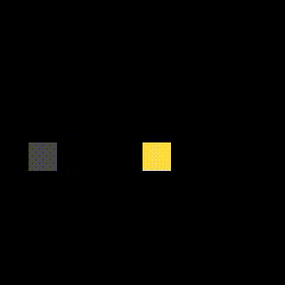
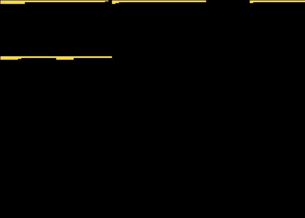

# lesson 5: Vectorize, parallelize, unroll and tile your code

## Code

- https://halide-lang.org/tutorials/tutorial_lesson_05_scheduling_1.html

## Build & Run

```bash
dongkesi@2020:~/github/Halide/build/distrib/tutorial$ g++ lesson_05*.cpp -g -I ../include -L ../bin -lHalide -lpthread -ldl -o lesson_05 -std=c++11
dongkesi@2020:~/github/Halide/build/distrib/tutorial$ LD_LIBRARY_PATH=../bin ./lesson_05
```

## 代码分析
### First we observe the default ordering
#### Section 1
- 默认会优化为按行计算，因为这是速度最快的
```c
{
    Func gradient("gradient");
    gradient(x, y) = x + y;
    gradient.trace_stores();

    // By default we walk along the rows and then down the
    // columns. This means x varies quickly, and y varies
    // slowly. x is the column and y is the row, so this is a
    // row-major traversal.
    printf("Evaluating gradient row-major\n");
    Buffer<int> output = gradient.realize(4, 4);
    // Click to show output ...

    // See below for a visualization of
    // what this did.
```

- output
```c
Evaluating gradient row-major
Begin pipeline gradient.0()
Tag gradient.0() tag = "func_type_and_dim: 1 0 32 1 2 0 4 0 4"
Store gradient.0(0, 0) = 0
Store gradient.0(1, 0) = 1
Store gradient.0(2, 0) = 2
Store gradient.0(3, 0) = 3
Store gradient.0(0, 1) = 1
Store gradient.0(1, 1) = 2
Store gradient.0(2, 1) = 3
Store gradient.0(3, 1) = 4
Store gradient.0(0, 2) = 2
Store gradient.0(1, 2) = 3
Store gradient.0(2, 2) = 4
Store gradient.0(3, 2) = 5
Store gradient.0(0, 3) = 3
Store gradient.0(1, 3) = 4
Store gradient.0(2, 3) = 5
Store gradient.0(3, 3) = 6
End pipeline gradient.0()
```
#### Section 2
- 以上代码的功能与以下的C代码等价
```c
    // The equivalent C is:
    printf("Equivalent C:\n");
    for (int y = 0; y < 4; y++) {
        for (int x = 0; x < 4; x++) {
            printf("Evaluating at x = %d, y = %d: %d\n", x, y, x + y);
        }
    }
    printf("\n\n");
```
- output
```c
Equivalent C:
Evaluating at x = 0, y = 0: 0
Evaluating at x = 1, y = 0: 1
Evaluating at x = 2, y = 0: 2
Evaluating at x = 3, y = 0: 3
Evaluating at x = 0, y = 1: 1
Evaluating at x = 1, y = 1: 2
Evaluating at x = 2, y = 1: 3
Evaluating at x = 3, y = 1: 4
Evaluating at x = 0, y = 2: 2
Evaluating at x = 1, y = 2: 3
Evaluating at x = 2, y = 2: 4
Evaluating at x = 3, y = 2: 5
Evaluating at x = 0, y = 3: 3
Evaluating at x = 1, y = 3: 4
Evaluating at x = 2, y = 3: 5
Evaluating at x = 3, y = 3: 6
```

#### Section 3
- 使用`print_loop_nest`打印伪代码
```c
    // Tracing is one useful way to understand what a schedule is
    // doing. You can also ask Halide to print out pseudocode
    // showing what loops Halide is generating:
    printf("Pseudo-code for the schedule:\n");
    gradient.print_loop_nest();
    printf("\n");
    // Click to show output ...

    // Because we're using the default ordering, it should print:
    // compute gradient:
    //   for y:
    //     for x:
    //       gradient(...) = ...
}
```
- Output
```c
Pseudo-code for the schedule:
produce gradient:
  for y:
    for x:
      gradient(...) = ...
```
### Reorder variables
#### Section 1
- 更改x,y的顺序
```c
{
    Func gradient("gradient_col_major");
    gradient(x, y) = x + y;
    gradient.trace_stores();

    // If we reorder x and y, we can walk down the columns
    // instead. The reorder call takes the arguments of the func,
    // and sets a new nesting order for the for loops that are
    // generated. The arguments are specified from the innermost
    // loop out, so the following call puts y in the inner loop:
    gradient.reorder(y, x);

    // This means y (the row) will vary quickly, and x (the
    // column) will vary slowly, so this is a column-major
    // traversal.

    printf("Evaluating gradient column-major\n");
    Buffer<int> output = gradient.realize(4, 4);
    // Click to show output ...

    // See below for a visualization of
    // what this did.
```

- Output
```c
Evaluating gradient column-major
Begin pipeline gradient_col_major.0()
Tag gradient_col_major.0() tag = "func_type_and_dim: 1 0 32 1 2 0 4 0 4"
Store gradient_col_major.0(0, 0) = 0
Store gradient_col_major.0(0, 1) = 1
Store gradient_col_major.0(0, 2) = 2
Store gradient_col_major.0(0, 3) = 3
Store gradient_col_major.0(1, 0) = 1
Store gradient_col_major.0(1, 1) = 2
Store gradient_col_major.0(1, 2) = 3
Store gradient_col_major.0(1, 3) = 4
Store gradient_col_major.0(2, 0) = 2
Store gradient_col_major.0(2, 1) = 3
Store gradient_col_major.0(2, 2) = 4
Store gradient_col_major.0(2, 3) = 5
Store gradient_col_major.0(3, 0) = 3
Store gradient_col_major.0(3, 1) = 4
Store gradient_col_major.0(3, 2) = 5
Store gradient_col_major.0(3, 3) = 6
End pipeline gradient_col_major.0()
```
#### Section 2
- 以上代码等价的C
```c         
    printf("Equivalent C:\n");
    for (int x = 0; x < 4; x++) {
        for (int y = 0; y < 4; y++) {
            printf("Evaluating at x = %d, y = %d: %d\n", x, y, x + y);
        }
    }
    printf("\n");
```
- Output
```c
Equivalent C:
Evaluating at x = 0, y = 0: 0
Evaluating at x = 0, y = 1: 1
Evaluating at x = 0, y = 2: 2
Evaluating at x = 0, y = 3: 3
Evaluating at x = 1, y = 0: 1
Evaluating at x = 1, y = 1: 2
Evaluating at x = 1, y = 2: 3
Evaluating at x = 1, y = 3: 4
Evaluating at x = 2, y = 0: 2
Evaluating at x = 2, y = 1: 3
Evaluating at x = 2, y = 2: 4
Evaluating at x = 2, y = 3: 5
Evaluating at x = 3, y = 0: 3
Evaluating at x = 3, y = 1: 4
Evaluating at x = 3, y = 2: 5
Evaluating at x = 3, y = 3: 6
```
#### Section 3
- 打印生成的伪代码
```c
    // If we print pseudo-code for this schedule, we'll see that
    // the loop over y is now inside the loop over x.
    printf("Pseudo-code for the schedule:\n");
    gradient.print_loop_nest();
    printf("\n");
    // Click to show output ...
}
```
- Output
```
Pseudo-code for the schedule:
produce gradient_col_major:
  for x:
    for y:
      gradient_col_major(...) = ...
```
### Split a variable into two
#### Section 1
- 这将x上的循环分为两个嵌套循环：`x_outer`上的外部循环和`x_inner`上的内部循环。拆分的最后一个参数是“拆分因子”。**内部循环从零到拆分因子**。外循环**从零开始到所需的范围x（在这种情况下为4）除以拆分因子**。在循环中，旧变量定义为`outer * factor + inner`。如果旧循环以非零值开始，则该值也将添加到循环中。
```c
{
    Func gradient("gradient_split");
    gradient(x, y) = x + y;
    gradient.trace_stores();

    // The most powerful primitive scheduling operation you can do
    // to a var is to split it into inner and outer sub-variables:
    Var x_outer, x_inner;
    gradient.split(x, x_outer, x_inner, 2);

    // This breaks the loop over x into two nested loops: an outer
    // one over x_outer, and an inner one over x_inner. The last
    // argument to split was the "split factor". The inner loop
    // runs from zero to the split factor. The outer loop runs
    // from zero to the extent required of x (4 in this case)
    // divided by the split factor. Within the loops, the old
    // variable is defined to be outer * factor + inner. If the
    // old loop started at a value other than zero, then that is
    // also added within the loops.

    printf("Evaluating gradient with x split into x_outer and x_inner \n");
    Buffer<int> output = gradient.realize(4, 4);
    // Click to show output ...
```
- Output
```c
Evaluating gradient with x split into x_outer and x_inner 
Begin pipeline gradient_split.0()
Tag gradient_split.0() tag = "func_type_and_dim: 1 0 32 1 2 0 4 0 4"
Store gradient_split.0(0, 0) = 0
Store gradient_split.0(1, 0) = 1
Store gradient_split.0(2, 0) = 2
Store gradient_split.0(3, 0) = 3
Store gradient_split.0(0, 1) = 1
Store gradient_split.0(1, 1) = 2
Store gradient_split.0(2, 1) = 3
Store gradient_split.0(3, 1) = 4
Store gradient_split.0(0, 2) = 2
Store gradient_split.0(1, 2) = 3
Store gradient_split.0(2, 2) = 4
Store gradient_split.0(3, 2) = 5
Store gradient_split.0(0, 3) = 3
Store gradient_split.0(1, 3) = 4
Store gradient_split.0(2, 3) = 5
Store gradient_split.0(3, 3) = 6
End pipeline gradient_split.0()
```
#### Section 2
```c
    printf("Equivalent C:\n");
    for (int y = 0; y < 4; y++) {
        for (int x_outer = 0; x_outer < 2; x_outer++) {
            for (int x_inner = 0; x_inner < 2; x_inner++) {
                // 在循环中，旧变量定义为`outer * factor + inner`
                int x = x_outer * 2 + x_inner;
                printf("Evaluating at x = %d, y = %d: %d\n", x, y, x + y);
            }
        }
    }
    printf("\n");
```
- Output
```c
Equivalent C:
Evaluating at x = 0, y = 0: 0
Evaluating at x = 1, y = 0: 1
Evaluating at x = 2, y = 0: 2
Evaluating at x = 3, y = 0: 3
Evaluating at x = 0, y = 1: 1
Evaluating at x = 1, y = 1: 2
Evaluating at x = 2, y = 1: 3
Evaluating at x = 3, y = 1: 4
Evaluating at x = 0, y = 2: 2
Evaluating at x = 1, y = 2: 3
Evaluating at x = 2, y = 2: 4
Evaluating at x = 3, y = 2: 5
Evaluating at x = 0, y = 3: 3
Evaluating at x = 1, y = 3: 4
Evaluating at x = 2, y = 3: 5
Evaluating at x = 3, y = 3: 6
```
#### Section 3
```c
    printf("Pseudo-code for the schedule:\n");
    gradient.print_loop_nest();
    printf("\n");
    // Click to show output ...

    // Note that the order of evaluation of pixels didn't actually
    // change! Splitting by itself does nothing, but it does open
    // up all of the scheduling possibilities that we will explore
    // below.
}
```
- Output
```c
Pseudo-code for the schedule:
produce gradient_split:
  for y:
    for x.v0:
      for x.v1 in [0, 1]:
        gradient_split(...) = ...
```
### Fuse two variables into one.
- Spliting 的对立面是“Fusing”。Fusing 两个变量会将两个循环合并到扩展范围乘积上的单个for循环中。**融合的重要性不如拆分**，但它也很有用（我们将在本课程的后面看到）。像拆分一样，**融合本身不会改变求值的顺序**。
#### Section 1
```c
{
    Func gradient("gradient_fused");
    gradient(x, y) = x + y;
    gradient.trace_stores(); // 源码少了这一句
    // The opposite of splitting is 'fusing'. Fusing two variables
    // merges the two loops into a single for loop over the
    // product of the extents. Fusing is less important than
    // splitting, but it also sees use (as we'll see later in this
    // lesson). Like splitting, fusing by itself doesn't change
    // the order of evaluation.
    Var fused;
    gradient.fuse(x, y, fused);

    printf("Evaluating gradient with x and y fused\n");
    Buffer<int> output = gradient.realize(4, 4);
```
- Output
```c
Evaluating gradient with x and y fused
Begin pipeline gradient_fused.0()
Tag gradient_fused.0() tag = "func_type_and_dim: 1 0 32 1 2 0 4 0 4"
Store gradient_fused.0(0, 0) = 0
Store gradient_fused.0(1, 0) = 1
Store gradient_fused.0(2, 0) = 2
Store gradient_fused.0(3, 0) = 3
Store gradient_fused.0(0, 1) = 1
Store gradient_fused.0(1, 1) = 2
Store gradient_fused.0(2, 1) = 3
Store gradient_fused.0(3, 1) = 4
Store gradient_fused.0(0, 2) = 2
Store gradient_fused.0(1, 2) = 3
Store gradient_fused.0(2, 2) = 4
Store gradient_fused.0(3, 2) = 5
Store gradient_fused.0(0, 3) = 3
Store gradient_fused.0(1, 3) = 4
Store gradient_fused.0(2, 3) = 5
Store gradient_fused.0(3, 3) = 6
End pipeline gradient_fused.0()
```
#### Section 2
```c
    printf("Equivalent C:\n");
    for (int fused = 0; fused < 4*4; fused++) {
        int y = fused / 4;
        int x = fused % 4;
        printf("Evaluating at x = %d, y = %d: %d\n", x, y, x + y);
    }
    printf("\n");
```
- Output
```c
Equivalent C:
Evaluating at x = 0, y = 0: 0
Evaluating at x = 1, y = 0: 1
Evaluating at x = 2, y = 0: 2
Evaluating at x = 3, y = 0: 3
Evaluating at x = 0, y = 1: 1
Evaluating at x = 1, y = 1: 2
Evaluating at x = 2, y = 1: 3
Evaluating at x = 3, y = 1: 4
Evaluating at x = 0, y = 2: 2
Evaluating at x = 1, y = 2: 3
Evaluating at x = 2, y = 2: 4
Evaluating at x = 3, y = 2: 5
Evaluating at x = 0, y = 3: 3
Evaluating at x = 1, y = 3: 4
Evaluating at x = 2, y = 3: 5
Evaluating at x = 3, y = 3: 6
```
#### Section 3
```c
    printf("Pseudo-code for the schedule:\n");
    gradient.print_loop_nest();
    printf("\n");
    // Click to show output ...
}
```
- Output
```c
Pseudo-code for the schedule:
produce gradient_fused:
  for x.v2:
    gradient_fused(...) = ...
```
### Evaluating in tiles
- 现在我们既可以拆分又可以重新排序，我们可以进行切片求值。让我们将x和y分别除以4，然后对var重新排序以表示tiled遍历。
- tiled遍历将域划分为小的矩形tiles，并且最外层迭代在tiles上，并且在其中进行遍历每个tile内的点。如果相邻像素使用重叠的输入数据（例如blur），则可能对性能有好处。我们可以这样表示tiled遍历：
- 【这里用两个split+reorder来描述一个tile，split表现在某一维度，但是tile在二维空间中，可以同时切割x，y】
#### Section 1
```c
{
    Func gradient("gradient_tiled");
    gradient(x, y) = x + y;
    gradient.trace_stores();

    // Now that we can both split and reorder, we can do tiled
    // evaluation. Let's split both x and y by a factor of four,
    // and then reorder the vars to express a tiled traversal.
    //
    // A tiled traversal splits the domain into small rectangular
    // tiles, and outermost iterates over the tiles, and within
    // that iterates over the points within each tile. It can be
    // good for performance if neighboring pixels use overlapping
    // input data, for example in a blur. We can express a tiled
    // traversal like so:
    Var x_outer, x_inner, y_outer, y_inner;
    gradient.split(x, x_outer, x_inner, 4);
    gradient.split(y, y_outer, y_inner, 4);
    // 这里的顺序是从内到外
    gradient.reorder(x_inner, y_inner, x_outer, y_outer);

    // This pattern is common enough that there's a shorthand for it:
    // 以上split+reorder可以用这一条语句代替
    /*
    接口定义
    Func &Func::tile(const VarOrRVar &x, const VarOrRVar &y,
                 const VarOrRVar &xi, const VarOrRVar &yi,
                 const Expr &xfactor, const Expr &yfactor,
                 TailStrategy tail)
    */
    // gradient.tile(x, y, x_outer, y_outer, x_inner, y_inner, 4, 4);

    printf("Evaluating gradient in 4x4 tiles\n");
    Buffer<int> output = gradient.realize(8, 8);
    // Click to show output ...

    // See below for a visualization of this
    // schedule.
```
      
- Output
```c
Evaluating gradient in 4x4 tiles
Begin pipeline gradient_tiled.0()
Tag gradient_tiled.0() tag = "func_type_and_dim: 1 0 32 1 2 0 8 0 8"
// y[0:3] x[0:3]
Store gradient_tiled.0(0, 0) = 0
Store gradient_tiled.0(1, 0) = 1
Store gradient_tiled.0(2, 0) = 2
Store gradient_tiled.0(3, 0) = 3
Store gradient_tiled.0(0, 1) = 1
Store gradient_tiled.0(1, 1) = 2
Store gradient_tiled.0(2, 1) = 3
Store gradient_tiled.0(3, 1) = 4
Store gradient_tiled.0(0, 2) = 2
Store gradient_tiled.0(1, 2) = 3
Store gradient_tiled.0(2, 2) = 4
Store gradient_tiled.0(3, 2) = 5
Store gradient_tiled.0(0, 3) = 3
Store gradient_tiled.0(1, 3) = 4
Store gradient_tiled.0(2, 3) = 5
Store gradient_tiled.0(3, 3) = 6
// y[0:3] x[4:7]
Store gradient_tiled.0(4, 0) = 4
Store gradient_tiled.0(5, 0) = 5
Store gradient_tiled.0(6, 0) = 6
Store gradient_tiled.0(7, 0) = 7
Store gradient_tiled.0(4, 1) = 5
Store gradient_tiled.0(5, 1) = 6
Store gradient_tiled.0(6, 1) = 7
Store gradient_tiled.0(7, 1) = 8
Store gradient_tiled.0(4, 2) = 6
Store gradient_tiled.0(5, 2) = 7
Store gradient_tiled.0(6, 2) = 8
Store gradient_tiled.0(7, 2) = 9
Store gradient_tiled.0(4, 3) = 7
Store gradient_tiled.0(5, 3) = 8
Store gradient_tiled.0(6, 3) = 9
Store gradient_tiled.0(7, 3) = 10
// y[4:7] x[0:3]
Store gradient_tiled.0(0, 4) = 4
Store gradient_tiled.0(1, 4) = 5
Store gradient_tiled.0(2, 4) = 6
Store gradient_tiled.0(3, 4) = 7
Store gradient_tiled.0(0, 5) = 5
Store gradient_tiled.0(1, 5) = 6
Store gradient_tiled.0(2, 5) = 7
Store gradient_tiled.0(3, 5) = 8
Store gradient_tiled.0(0, 6) = 6
Store gradient_tiled.0(1, 6) = 7
Store gradient_tiled.0(2, 6) = 8
Store gradient_tiled.0(3, 6) = 9
Store gradient_tiled.0(0, 7) = 7
Store gradient_tiled.0(1, 7) = 8
Store gradient_tiled.0(2, 7) = 9
Store gradient_tiled.0(3, 7) = 10
// y[4:7] x[4:7]
Store gradient_tiled.0(4, 4) = 8
Store gradient_tiled.0(5, 4) = 9
Store gradient_tiled.0(6, 4) = 10
Store gradient_tiled.0(7, 4) = 11
Store gradient_tiled.0(4, 5) = 9
Store gradient_tiled.0(5, 5) = 10
Store gradient_tiled.0(6, 5) = 11
Store gradient_tiled.0(7, 5) = 12
Store gradient_tiled.0(4, 6) = 10
Store gradient_tiled.0(5, 6) = 11
Store gradient_tiled.0(6, 6) = 12
Store gradient_tiled.0(7, 6) = 13
Store gradient_tiled.0(4, 7) = 11
Store gradient_tiled.0(5, 7) = 12
Store gradient_tiled.0(6, 7) = 13
Store gradient_tiled.0(7, 7) = 14
End pipeline gradient_tiled.0()
```
#### Section 2
```c
printf("Equivalent C:\n");
for (int y_outer = 0; y_outer < 2; y_outer++) {
    for (int x_outer = 0; x_outer < 2; x_outer++) {
        for (int y_inner = 0; y_inner < 4; y_inner++) {
            for (int x_inner = 0; x_inner < 4; x_inner++) {
                int x = x_outer * 4 + x_inner;
                int y = y_outer * 4 + y_inner;
                printf("Evaluating at x = %d, y = %d: %d\n", x, y, x + y);
            }
        }
    }
}
printf("\n");
```
- Output
```c
Equivalent C:
Evaluating at x = 0, y = 0: 0
Evaluating at x = 1, y = 0: 1
Evaluating at x = 2, y = 0: 2
Evaluating at x = 3, y = 0: 3
Evaluating at x = 0, y = 1: 1
Evaluating at x = 1, y = 1: 2
Evaluating at x = 2, y = 1: 3
Evaluating at x = 3, y = 1: 4
Evaluating at x = 0, y = 2: 2
Evaluating at x = 1, y = 2: 3
Evaluating at x = 2, y = 2: 4
Evaluating at x = 3, y = 2: 5
Evaluating at x = 0, y = 3: 3
Evaluating at x = 1, y = 3: 4
Evaluating at x = 2, y = 3: 5
Evaluating at x = 3, y = 3: 6
Evaluating at x = 4, y = 0: 4
Evaluating at x = 5, y = 0: 5
Evaluating at x = 6, y = 0: 6
Evaluating at x = 7, y = 0: 7
Evaluating at x = 4, y = 1: 5
Evaluating at x = 5, y = 1: 6
Evaluating at x = 6, y = 1: 7
Evaluating at x = 7, y = 1: 8
Evaluating at x = 4, y = 2: 6
Evaluating at x = 5, y = 2: 7
Evaluating at x = 6, y = 2: 8
Evaluating at x = 7, y = 2: 9
Evaluating at x = 4, y = 3: 7
Evaluating at x = 5, y = 3: 8
Evaluating at x = 6, y = 3: 9
Evaluating at x = 7, y = 3: 10
Evaluating at x = 0, y = 4: 4
Evaluating at x = 1, y = 4: 5
Evaluating at x = 2, y = 4: 6
Evaluating at x = 3, y = 4: 7
Evaluating at x = 0, y = 5: 5
Evaluating at x = 1, y = 5: 6
Evaluating at x = 2, y = 5: 7
Evaluating at x = 3, y = 5: 8
Evaluating at x = 0, y = 6: 6
Evaluating at x = 1, y = 6: 7
Evaluating at x = 2, y = 6: 8
Evaluating at x = 3, y = 6: 9
Evaluating at x = 0, y = 7: 7
Evaluating at x = 1, y = 7: 8
Evaluating at x = 2, y = 7: 9
Evaluating at x = 3, y = 7: 10
Evaluating at x = 4, y = 4: 8
Evaluating at x = 5, y = 4: 9
Evaluating at x = 6, y = 4: 10
Evaluating at x = 7, y = 4: 11
Evaluating at x = 4, y = 5: 9
Evaluating at x = 5, y = 5: 10
Evaluating at x = 6, y = 5: 11
Evaluating at x = 7, y = 5: 12
Evaluating at x = 4, y = 6: 10
Evaluating at x = 5, y = 6: 11
Evaluating at x = 6, y = 6: 12
Evaluating at x = 7, y = 6: 13
Evaluating at x = 4, y = 7: 11
Evaluating at x = 5, y = 7: 12
Evaluating at x = 6, y = 7: 13
Evaluating at x = 7, y = 7: 14
```
#### Section 3
```c
    printf("Pseudo-code for the schedule:\n");
    gradient.print_loop_nest();
    printf("\n");
    // Click to show output ...
}
```
- Output
```c
Pseudo-code for the schedule:
produce gradient_tiled:
  for y.v5:
    for x.v3:
      for y.v6 in [0, 3]:
        for x.v4 in [0, 3]:
          gradient_tiled(...) = ...
```
### Evaluating in vectors

#### Section 1
- 拆分的好处在于，它确保内部变量**从零到拆分因子**。在大多数情况下，拆分因子将是编译时常量，因此我们可以**使用单个向量化计算来替换内部循环**。这次我们将除以四，因为在X86上我们**可以使用SSE来计算4-wide向量**。
```c
{
    Func gradient("gradient_in_vectors");
    gradient(x, y) = x + y;
    gradient.trace_stores();

    // The nice thing about splitting is that it guarantees the
    // inner variable runs from zero to the split factor. Most of
    // the time the split-factor will be a compile-time constant,
    // so we can replace the loop over the inner variable with a
    // single vectorized computation. This time we'll split by a
    // factor of four, because on X86 we can use SSE to compute in
    // 4-wide vectors.
    Var x_outer, x_inner;
    gradient.split(x, x_outer, x_inner, 4);
    gradient.vectorize(x_inner);

    // Splitting and then vectorizing the inner variable is common
    // enough that there's a short-hand for it. We could have also
    // said:
    //
    // gradient.vectorize(x, 4);
    //
    // which is equivalent to:
    //
    // gradient.split(x, x, x_inner, 4);
    // gradient.vectorize(x_inner);
    //
    // Note that in this case we reused the name 'x' as the new
    // outer variable. Later scheduling calls that refer to x
    // will refer to this new outer variable named x.

    // This time we'll evaluate over an 8x4 box, so that we have
    // more than one vector of work per scanline.
    printf("Evaluating gradient with x_inner vectorized \n");
    Buffer<int> output = gradient.realize(8, 4);
    // Click to show output ...

    // See below for a visualization.
```


- Output
```c
Evaluating gradient with x_inner vectorized 
Begin pipeline gradient_in_vectors.0()
Tag gradient_in_vectors.0() tag = "func_type_and_dim: 1 0 32 1 2 0 8 0 4"
// 第一行代表[0,0], [1,0], [2,0], [3,0]向量化计算
Store gradient_in_vectors.0(<0, 1, 2, 3>, <0, 0, 0, 0>) = <0, 1, 2, 3>
Store gradient_in_vectors.0(<4, 5, 6, 7>, <0, 0, 0, 0>) = <4, 5, 6, 7>
Store gradient_in_vectors.0(<0, 1, 2, 3>, <1, 1, 1, 1>) = <1, 2, 3, 4>
Store gradient_in_vectors.0(<4, 5, 6, 7>, <1, 1, 1, 1>) = <5, 6, 7, 8>
Store gradient_in_vectors.0(<0, 1, 2, 3>, <2, 2, 2, 2>) = <2, 3, 4, 5>
Store gradient_in_vectors.0(<4, 5, 6, 7>, <2, 2, 2, 2>) = <6, 7, 8, 9>
Store gradient_in_vectors.0(<0, 1, 2, 3>, <3, 3, 3, 3>) = <3, 4, 5, 6>
Store gradient_in_vectors.0(<4, 5, 6, 7>, <3, 3, 3, 3>) = <7, 8, 9, 10>
End pipeline gradient_in_vectors.0()
```
#### Section 2  
- 如果写成如下的格式，编译器会自动编译为SSE向量操作   
```c
    printf("Equivalent C:\n");
    for (int y = 0; y < 4; y++) {
        for (int x_outer = 0; x_outer < 2; x_outer++) {
            // The loop over x_inner has gone away, and has been
            // replaced by a vectorized version of the
            // expression. On x86 processors, Halide generates SSE
            // for all of this.
            int x_vec[] = {x_outer * 4 + 0,
                            x_outer * 4 + 1,
                            x_outer * 4 + 2,
                            x_outer * 4 + 3};
            int val[] = {x_vec[0] + y,
                          x_vec[1] + y,
                          x_vec[2] + y,
                          x_vec[3] + y};
            printf("Evaluating at <%d, %d, %d, %d>, <%d, %d, %d, %d>:"
                    " <%d, %d, %d, %d>\n",
                    x_vec[0], x_vec[1], x_vec[2], x_vec[3],
                    y, y, y, y,
                    val[0], val[1], val[2], val[3]);
        }
    }
    printf("\n");
```
- Output
```c
Equivalent C:
Evaluating at <0, 1, 2, 3>, <0, 0, 0, 0>: <0, 1, 2, 3>
Evaluating at <4, 5, 6, 7>, <0, 0, 0, 0>: <4, 5, 6, 7>
Evaluating at <0, 1, 2, 3>, <1, 1, 1, 1>: <1, 2, 3, 4>
Evaluating at <4, 5, 6, 7>, <1, 1, 1, 1>: <5, 6, 7, 8>
Evaluating at <0, 1, 2, 3>, <2, 2, 2, 2>: <2, 3, 4, 5>
Evaluating at <4, 5, 6, 7>, <2, 2, 2, 2>: <6, 7, 8, 9>
Evaluating at <0, 1, 2, 3>, <3, 3, 3, 3>: <3, 4, 5, 6>
Evaluating at <4, 5, 6, 7>, <3, 3, 3, 3>: <7, 8, 9, 10>
```
#### Section 3
```c
        printf("Pseudo-code for the schedule:\n");
        gradient.print_loop_nest();
        printf("\n");
        // Click to show output ...
    }
```
- Output
```c
Pseudo-code for the schedule:
produce gradient_in_vectors:
  for y:
    for x.v7:
      vectorized x.v8 in [0, 3]:
        gradient_in_vectors(...) = ...
```
### Unrolling a loop
- **如果多个像素共享重叠的数据，则unroll计算是有意义的，以便共享值仅计算或加载一次**。我们这样做与表示向量化的方式类似。我们拆分一个维度，然后完全展开**内部**变量的循环。**展开不会改变求值的顺序**。
#### Section 1
```c
{
    Func gradient("gradient_unroll");
    gradient(x, y) = x + y;
    gradient.trace_stores();

    // If multiple pixels share overlapping data, it can make
    // sense to unroll a computation so that shared values are
    // only computed or loaded once. We do this similarly to how
    // we expressed vectorizing. We split a dimension and then
    // fully unroll the loop of the inner variable. Unrolling
    // doesn't change the order in which things are evaluated.
    Var x_outer, x_inner;
    gradient.split(x, x_outer, x_inner, 2);
    gradient.unroll(x_inner);

    // The shorthand for this is:
    // gradient.unroll(x, 2);

    printf("Evaluating gradient unrolled by a factor of two\n");
    Buffer<int> result = gradient.realize(4, 4);
    // Click to show output ...
```
- Output
```c
Evaluating gradient unrolled by a factor of two
Begin pipeline gradient_unroll.0()
Tag gradient_unroll.0() tag = "func_type_and_dim: 1 0 32 1 2 0 4 0 4"
Store gradient_unroll.0(0, 0) = 0
Store gradient_unroll.0(1, 0) = 1
Store gradient_unroll.0(2, 0) = 2
Store gradient_unroll.0(3, 0) = 3
Store gradient_unroll.0(0, 1) = 1
Store gradient_unroll.0(1, 1) = 2
Store gradient_unroll.0(2, 1) = 3
Store gradient_unroll.0(3, 1) = 4
Store gradient_unroll.0(0, 2) = 2
Store gradient_unroll.0(1, 2) = 3
Store gradient_unroll.0(2, 2) = 4
Store gradient_unroll.0(3, 2) = 5
Store gradient_unroll.0(0, 3) = 3
Store gradient_unroll.0(1, 3) = 4
Store gradient_unroll.0(2, 3) = 5
Store gradient_unroll.0(3, 3) = 6
End pipeline gradient_unroll.0()
```
#### Section 2
```c
    printf("Equivalent C:\n");
    for (int y = 0; y < 4; y++) {
        for (int x_outer = 0; x_outer < 2; x_outer++) {
            // Instead of a for loop over x_inner, we get two
            // copies of the innermost statement.
            {
                int x_inner = 0;
                int x = x_outer * 2 + x_inner;
                printf("Evaluating at x = %d, y = %d: %d\n", x, y, x + y);
            }
            {
                int x_inner = 1;
                int x = x_outer * 2 + x_inner;
                printf("Evaluating at x = %d, y = %d: %d\n", x, y, x + y);
            }
        }
    }
    printf("\n");
```
- Output
```c
Equivalent C:
Evaluating at x = 0, y = 0: 0
Evaluating at x = 1, y = 0: 1
Evaluating at x = 2, y = 0: 2
Evaluating at x = 3, y = 0: 3
Evaluating at x = 0, y = 1: 1
Evaluating at x = 1, y = 1: 2
Evaluating at x = 2, y = 1: 3
Evaluating at x = 3, y = 1: 4
Evaluating at x = 0, y = 2: 2
Evaluating at x = 1, y = 2: 3
Evaluating at x = 2, y = 2: 4
Evaluating at x = 3, y = 2: 5
Evaluating at x = 0, y = 3: 3
Evaluating at x = 1, y = 3: 4
Evaluating at x = 2, y = 3: 5
Evaluating at x = 3, y = 3: 6
```
#### Section 3
```c
    printf("Pseudo-code for the schedule:\n");
    gradient.print_loop_nest();
    printf("\n");
    // Click to show output ...
}
```
- Output
```c
Pseudo-code for the schedule:
produce gradient_unroll:
  for y:
    for x.v9:
      unrolled x.v10 in [0, 1]:
        gradient_unroll(...) = ...
```
### Splitting by factors that don't divide the extent.

#### Section 1
- 拆分可确保内部循环**从零到拆分因子**，这对于我们上面看到的用法很重要。那么，当我们希望求值的`x`的总范围不是分割因子的倍数时，会发生什么？ 我们将系数除以3，然后评估7x2框而不是我们一直使用的4x4框。
```c
{
    Func gradient("gradient_split_7x2");
    gradient(x, y) = x + y;
    gradient.trace_stores();

    // Splitting guarantees that the inner loop runs from zero to
    // the split factor, which is important for the uses we saw
    // above. So what happens when the total extent we wish to
    // evaluate x over isn't a multiple of the split factor? We'll
    // split by a factor three, and we'll evaluate gradient over a
    // 7x2 box instead of the 4x4 box we've been using.
    Var x_outer, x_inner;
    gradient.split(x, x_outer, x_inner, 3);

    printf("Evaluating gradient over a 7x2 box with x split by three \n");
    Buffer<int> output = gradient.realize(7, 2);
    // Click to show output ...

    // See below for a visualization
    // of what happened. Note that some points get evaluated more
    // than once!
```

- Output
```c
Evaluating gradient over a 7x2 box with x split by three 
Begin pipeline gradient_split_7x2.0()
Tag gradient_split_7x2.0() tag = "func_type_and_dim: 1 0 32 1 2 0 7 0 2"
// x[0:2]
Store gradient_split_7x2.0(0, 0) = 0
Store gradient_split_7x2.0(1, 0) = 1
Store gradient_split_7x2.0(2, 0) = 2
// x[3:5]
Store gradient_split_7x2.0(3, 0) = 3
Store gradient_split_7x2.0(4, 0) = 4
Store gradient_split_7x2.0(5, 0) = 5
// x[4:6] 这里重复计算了x[4:5]
Store gradient_split_7x2.0(4, 0) = 4
Store gradient_split_7x2.0(5, 0) = 5
Store gradient_split_7x2.0(6, 0) = 6
Store gradient_split_7x2.0(0, 1) = 1
Store gradient_split_7x2.0(1, 1) = 2
Store gradient_split_7x2.0(2, 1) = 3
Store gradient_split_7x2.0(3, 1) = 4
Store gradient_split_7x2.0(4, 1) = 5
Store gradient_split_7x2.0(5, 1) = 6
// x[4:6] 这里也是重复计算了x[4:5]
Store gradient_split_7x2.0(4, 1) = 5
Store gradient_split_7x2.0(5, 1) = 6
Store gradient_split_7x2.0(6, 1) = 7
End pipeline gradient_split_7x2.0()
```
#### Section 2
- 从程序可以看出最后一次x_outer循环强制从倒数第三个开始，然后算最后3个。
```c
    printf("Equivalent C:\n");
    for (int y = 0; y < 2; y++) {
        for (int x_outer = 0; x_outer < 3; x_outer++) { // Now runs from 0 to 2
            for (int x_inner = 0; x_inner < 3; x_inner++) {
                int x = x_outer * 3;
                // Before we add x_inner, make sure we don't
                // evaluate points outside of the 7x2 box. We'll
                // clamp x to be at most 4 (7 minus the split
                // factor).
                if (x > 4) x = 4;
                x += x_inner;
                printf("Evaluating at x = %d, y = %d: %d\n", x, y, x + y);
            }
        }
    }
    printf("\n");
```
- Output
```c
Equivalent C:
// x[0:2]
Evaluating at x = 0, y = 0: 0
Evaluating at x = 1, y = 0: 1
Evaluating at x = 2, y = 0: 2
// x[3:5]
Evaluating at x = 3, y = 0: 3
Evaluating at x = 4, y = 0: 4
Evaluating at x = 5, y = 0: 5
// x[4:6] 重复使用了x[4:5]
Evaluating at x = 4, y = 0: 4
Evaluating at x = 5, y = 0: 5
Evaluating at x = 6, y = 0: 6
Evaluating at x = 0, y = 1: 1
Evaluating at x = 1, y = 1: 2
Evaluating at x = 2, y = 1: 3
Evaluating at x = 3, y = 1: 4
Evaluating at x = 4, y = 1: 5
Evaluating at x = 5, y = 1: 6
Evaluating at x = 4, y = 1: 5
Evaluating at x = 5, y = 1: 6
Evaluating at x = 6, y = 1: 7
```
#### Section 3
- 如果阅读输出，您将看到对某些坐标进行了多次求值。通常没关系，因为**纯Halide函数没有副作用**，因此可以安全地多次求值同一点。如果您像我们一样使用C函数，则有责任确保可以处理多次被求值的同一点。
  
  一般规则是：如果我们要求`x`从`x_min`到`x_min + x_extent`，并且除以因子`factor`，则：
  - x_outer runs from 0 to (x_extent + factor - 1)/factor
  - x_inner runs from 0 to factor
  - x = min(x_outer * factor, x_extent - factor) + x_inner + x_min
  
  在我们的示例中，x_min为0，x_extent为7，factor为3。

  但是，如果您编写带有**更新定义的Halide函数**（请参阅第9节），那么**多次求值同一点是不安全的**，因此我们不会应用此技巧。取而代之的是，计算的值范围将四舍五入到拆分因子的下一个倍数。

```c
    printf("Pseudo-code for the schedule:\n");
    gradient.print_loop_nest();
    printf("\n");
    // Click to show output ...

    // If you read the output, you'll see that some coordinates
    // were evaluated more than once. That's generally OK, because
    // pure Halide functions have no side-effects, so it's safe to
    // evaluate the same point multiple times. If you're calling
    // out to C functions like we are, it's your responsibility to
    // make sure you can handle the same point being evaluated
    // multiple times.

    // The general rule is: If we require x from x_min to x_min + x_extent, and
    // we split by a factor 'factor', then:
    //
    // x_outer runs from 0 to (x_extent + factor - 1)/factor
    // x_inner runs from 0 to factor
    // x = min(x_outer * factor, x_extent - factor) + x_inner + x_min
    //
    // In our example, x_min was 0, x_extent was 7, and factor was 3.

    // However, if you write a Halide function with an update
    // definition (see lesson 9), then it is not safe to evaluate
    // the same point multiple times, so we won't apply this
    // trick. Instead the range of values computed will be rounded
    // up to the next multiple of the split factor.
}
```
- Output
```c
Pseudo-code for the schedule:
produce gradient_split_7x2:
  for y:
    for x.v11:
      for x.v12 in [0, 2]:
        gradient_split_7x2(...) = ...
```
### Fusing, tiling, and parallelizing

#### Section 1
- 在上一课中，我们看到了可以对变量进行并行化的过程。在这里，我们将其与fusing和tiling结合起来以表达有用的模式-**并行处理tiles**。
  
  这是融合的亮点。当您想跨多个维度并行化而不引入嵌套并行性时，融合会有所帮助。嵌套并行性（并行for循环中的parallel for循环）受Halide支持，但与将并行变量融合到单个并行for循环中相比，性能通常较差。
```c
{
    // We saw in the previous lesson that we can parallelize
    // across a variable. Here we combine it with fusing and
    // tiling to express a useful pattern - processing tiles in
    // parallel.

    // This is where fusing shines. Fusing helps when you want to
    // parallelize across multiple dimensions without introducing
    // nested parallelism. Nested parallelism (parallel for loops
    // within parallel for loops) is supported by Halide, but
    // often gives poor performance compared to fusing the
    // parallel variables into a single parallel for loop.

    Func gradient("gradient_fused_tiles");
    gradient(x, y) = x + y;
    gradient.trace_stores();

    // First we'll tile, then we'll fuse the tile indices and
    // parallelize across the combination.
    Var x_outer, y_outer, x_inner, y_inner, tile_index;
    gradient.tile(x, y, x_outer, y_outer, x_inner, y_inner, 4, 4);
    gradient.fuse(x_outer, y_outer, tile_index);
    gradient.parallel(tile_index);

    // The scheduling calls all return a reference to the Func, so
    // you can also chain them together into a single statement to
    // make things slightly clearer:
    //
    // gradient
    //     .tile(x, y, x_outer, y_outer, x_inner, y_inner, 2, 2)
    //     .fuse(x_outer, y_outer, tile_index)
    //     .parallel(tile_index);


    printf("Evaluating gradient tiles in parallel\n");
    Buffer<int> output = gradient.realize(8, 8);
    // Click to show output ...

    // The tiles should occur in arbitrary order, but within each
    // tile the pixels will be traversed in row-major order. See
    // below for a visualization.
```

> 虽然显示的方块无规则，但是每个4x4的tile之内是按顺序输出的，这里模拟的时单CPU的多线程，所以同时只有一个黄色亮块，在各个线程之间切换。


> 减速5倍显示

- Output
```c
Evaluating gradient tiles in parallel
Begin pipeline gradient_fused_tiles.0()
Tag gradient_fused_tiles.0() tag = "func_type_and_dim: 1 0 32 1 2 0 8 0 8"
Store gradient_fused_tiles.0(0, 0) = 0
Store gradient_fused_tiles.0(1, 0) = 1
Store gradient_fused_tiles.0(2, 0) = 2
Store gradient_fused_tiles.0(3, 0) = 3
Store gradient_fused_tiles.0(0, 1) = 1
Store gradient_fused_tiles.0(1, 1) = 2
Store gradient_fused_tiles.0(2, 1) = 3
Store gradient_fused_tiles.0(3, 1) = 4
Store gradient_fused_tiles.0(0, 2) = 2
Store gradient_fused_tiles.0(1, 2) = 3
Store gradient_fused_tiles.0(2, 2) = 4
Store gradient_fused_tiles.0(3, 2) = 5
Store gradient_fused_tiles.0(0, 3) = 3
Store gradient_fused_tiles.0(1, 3) = 4
Store gradient_fused_tiles.0(2, 3) = 5
Store gradient_fused_tiles.0(3, 3) = 6
Store gradient_fused_tiles.0(4, 0) = 4
Store gradient_fused_tiles.0(5, 0) = 5
Store gradient_fused_tiles.0(6, 0) = 6
Store gradient_fused_tiles.0(7, 0) = 7
Store gradient_fused_tiles.0(4, 1) = 5
Store gradient_fused_tiles.0(5, 1) = 6
Store gradient_fused_tiles.0(6, 1) = 7
Store gradient_fused_tiles.0(7, 1) = 8
Store gradient_fused_tiles.0(4, 2) = 6
Store gradient_fused_tiles.0(0, 4) = 4
Store gradient_fused_tiles.0(5, 2) = 7
Store gradient_fused_tiles.0(4, 4) = 8
Store gradient_fused_tiles.0(1, 4) = 5
Store gradient_fused_tiles.0(5, 4) = 9
Store gradient_fused_tiles.0(2, 4) = 6
Store gradient_fused_tiles.0(6, 2) = 8
Store gradient_fused_tiles.0(7, 2) = 9
Store gradient_fused_tiles.0(3, 4) = 7
Store gradient_fused_tiles.0(6, 4) = 10
Store gradient_fused_tiles.0(0, 5) = 5
Store gradient_fused_tiles.0(7, 4) = 11
Store gradient_fused_tiles.0(4, 3) = 7
Store gradient_fused_tiles.0(4, 5) = 9
Store gradient_fused_tiles.0(1, 5) = 6
Store gradient_fused_tiles.0(5, 5) = 10
Store gradient_fused_tiles.0(2, 5) = 7
Store gradient_fused_tiles.0(5, 3) = 8
Store gradient_fused_tiles.0(6, 5) = 11
Store gradient_fused_tiles.0(3, 5) = 8
Store gradient_fused_tiles.0(7, 5) = 12
Store gradient_fused_tiles.0(0, 6) = 6
Store gradient_fused_tiles.0(6, 3) = 9
Store gradient_fused_tiles.0(4, 6) = 10
Store gradient_fused_tiles.0(1, 6) = 7
Store gradient_fused_tiles.0(5, 6) = 11
Store gradient_fused_tiles.0(2, 6) = 8
Store gradient_fused_tiles.0(7, 3) = 10
Store gradient_fused_tiles.0(3, 6) = 9
Store gradient_fused_tiles.0(6, 6) = 12
Store gradient_fused_tiles.0(0, 7) = 7
Store gradient_fused_tiles.0(7, 6) = 13
Store gradient_fused_tiles.0(1, 7) = 8
Store gradient_fused_tiles.0(4, 7) = 11
Store gradient_fused_tiles.0(2, 7) = 9
Store gradient_fused_tiles.0(5, 7) = 12
Store gradient_fused_tiles.0(3, 7) = 10
Store gradient_fused_tiles.0(6, 7) = 13
Store gradient_fused_tiles.0(7, 7) = 14
End pipeline gradient_fused_tiles.0()
```
- HL_NUM_THREADS=4 LD_LIBRARY_PATH=../bin ./lesson_05
- HL_NUM_THREADS=1 LD_LIBRARY_PATH=../bin ./lesson_05
  > 如果使用单线程方式，那么是按顺序输出，相当于去除了并行
#### Section 2   
```c
    printf("Equivalent (serial) C:\n");
    // This outermost loop should be a parallel for loop, but that's hard in C.
    // 2. 然后把外部的x,y融合，充分利用并行，
    for (int tile_index = 0; tile_index < 4; tile_index++) {
        int y_outer = tile_index / 2;
        int x_outer = tile_index % 2;
        // 1. 以下部分是小4x4的tile
        for (int y_inner = 0; y_inner < 4; y_inner++) {
            for (int x_inner = 0; x_inner < 4; x_inner++) {
                int y = y_outer * 4 + y_inner;
                int x = x_outer * 4 + x_inner;
                printf("Evaluating at x = %d, y = %d: %d\n", x, y, x + y);
            }
        }
    }
    printf("\n");
```
- Output
  > C 代码很难做到最外层代码的并行执行，可以试试OpenMP
```c
Equivalent (serial) C:
Evaluating at x = 0, y = 0: 0
Evaluating at x = 1, y = 0: 1
Evaluating at x = 2, y = 0: 2
Evaluating at x = 3, y = 0: 3
Evaluating at x = 0, y = 1: 1
Evaluating at x = 1, y = 1: 2
Evaluating at x = 2, y = 1: 3
Evaluating at x = 3, y = 1: 4
Evaluating at x = 0, y = 2: 2
Evaluating at x = 1, y = 2: 3
Evaluating at x = 2, y = 2: 4
Evaluating at x = 3, y = 2: 5
Evaluating at x = 0, y = 3: 3
Evaluating at x = 1, y = 3: 4
Evaluating at x = 2, y = 3: 5
Evaluating at x = 3, y = 3: 6
Evaluating at x = 4, y = 0: 4
Evaluating at x = 5, y = 0: 5
Evaluating at x = 6, y = 0: 6
Evaluating at x = 7, y = 0: 7
Evaluating at x = 4, y = 1: 5
Evaluating at x = 5, y = 1: 6
Evaluating at x = 6, y = 1: 7
Evaluating at x = 7, y = 1: 8
Evaluating at x = 4, y = 2: 6
Evaluating at x = 5, y = 2: 7
Evaluating at x = 6, y = 2: 8
Evaluating at x = 7, y = 2: 9
Evaluating at x = 4, y = 3: 7
Evaluating at x = 5, y = 3: 8
Evaluating at x = 6, y = 3: 9
Evaluating at x = 7, y = 3: 10
Evaluating at x = 0, y = 4: 4
Evaluating at x = 1, y = 4: 5
Evaluating at x = 2, y = 4: 6
Evaluating at x = 3, y = 4: 7
Evaluating at x = 0, y = 5: 5
Evaluating at x = 1, y = 5: 6
Evaluating at x = 2, y = 5: 7
Evaluating at x = 3, y = 5: 8
Evaluating at x = 0, y = 6: 6
Evaluating at x = 1, y = 6: 7
Evaluating at x = 2, y = 6: 8
Evaluating at x = 3, y = 6: 9
Evaluating at x = 0, y = 7: 7
Evaluating at x = 1, y = 7: 8
Evaluating at x = 2, y = 7: 9
Evaluating at x = 3, y = 7: 10
Evaluating at x = 4, y = 4: 8
Evaluating at x = 5, y = 4: 9
Evaluating at x = 6, y = 4: 10
Evaluating at x = 7, y = 4: 11
Evaluating at x = 4, y = 5: 9
Evaluating at x = 5, y = 5: 10
Evaluating at x = 6, y = 5: 11
Evaluating at x = 7, y = 5: 12
Evaluating at x = 4, y = 6: 10
Evaluating at x = 5, y = 6: 11
Evaluating at x = 6, y = 6: 12
Evaluating at x = 7, y = 6: 13
Evaluating at x = 4, y = 7: 11
Evaluating at x = 5, y = 7: 12
Evaluating at x = 6, y = 7: 13
Evaluating at x = 7, y = 7: 14
```
#### Section 3
```c
    printf("Pseudo-code for the schedule:\n");
    gradient.print_loop_nest();
    printf("\n");
    // Click to show output ...
}
```
- Output
```c
Pseudo-code for the schedule:
produce gradient_fused_tiles:
  parallel x.v13.v17:
    for y.v16 in [0, 3]:
      for x.v15 in [0, 3]:
        gradient_fused_tiles(...) = ...
```
### Putting it all together
#### Section 1

```c
// Putting it all together.
{
    // Are you ready? We're going to use all of the features above now.
    Func gradient_fast("gradient_fast");
    gradient_fast(x, y) = x + y;

    // We'll process 64x64 tiles in parallel.
    Var x_outer, y_outer, x_inner, y_inner, tile_index;
    gradient_fast
        .tile(x, y, x_outer, y_outer, x_inner, y_inner, 64, 64)
        .fuse(x_outer, y_outer, tile_index)
        .parallel(tile_index);

    // We'll compute two scanlines at once while we walk across
    // each tile. We'll also vectorize in x. The easiest way to
    // express this is to recursively tile again within each tile
    // into 4x2 subtiles, then vectorize the subtiles across x and
    // unroll them across y:
    /*
    当我们跨过每个tile时，我们将一次计算两条扫描线。我们还将在x中向量化。最简
    单的表达方式是在每个tile中再次递归地将其划分为4x2子图块，然后将`x`上的
    subtile 向量化并在y上展开它们：

    再次看下tile API
    Func &Func::tile(const VarOrRVar &x, const VarOrRVar &y,
                 const VarOrRVar &xi, const VarOrRVar &yi,
                 const Expr &xfactor, const Expr &yfactor,
                 TailStrategy tail)
    */
    Var x_inner_outer, y_inner_outer, x_vectors, y_pairs;
    gradient_fast
        .tile(x_inner, y_inner, x_inner_outer, y_inner_outer, x_vectors, y_pairs, 4, 2)
        .vectorize(x_vectors)
        .unroll(y_pairs);

    // Note that we didn't do any explicit splitting or
    // reordering. Those are the most important primitive
    // operations, but mostly they are buried underneath tiling,
    // vectorizing, or unrolling calls.

    // Now let's evaluate this over a range which is not a
    // multiple of the tile size.

    // If you like you can turn on tracing, but it's going to
    // produce a lot of printfs. Instead we'll compute the answer
    // both in C and Halide and see if the answers match.
    /*
    请注意，我们没有进行任何显式的拆分或重新排序。这些是最重要的原始操作，但
    是大多数情况下，它们隐藏在tile，向量化或展开调用之下。
    
    现在让我们在不是tile大小倍数的范围内进行求值。
    
    如果愿意，您可以打开跟踪，但是它将产生很多printfs。相反，我们将同时使用C
    语言和Halide计算答案，并查看答案是否匹配。
    */
    Buffer<int> result = gradient_fast.realize(350, 250);

    // See below for a visualization.
```
   

#### Section 2
```c
    printf("Checking Halide result against equivalent C...\n");
    for (int tile_index = 0; tile_index < 6 * 4; tile_index++) {
        int y_outer = tile_index / 4;
        int x_outer = tile_index % 4;
        for (int y_inner_outer = 0; y_inner_outer < 64/2; y_inner_outer++) {
            for (int x_inner_outer = 0; x_inner_outer < 64/4; x_inner_outer++) {
                // We're vectorized across x
                int x = std::min(x_outer * 64, 350-64) + x_inner_outer*4;
                int x_vec[4] = {x + 0,
                                x + 1,
                                x + 2,
                                x + 3};

                // And we unrolled across y
                int y_base = std::min(y_outer * 64, 250-64) + y_inner_outer*2;
                {
                    // y_pairs = 0
                    int y = y_base + 0;
                    int y_vec[4] = {y, y, y, y};
                    int val[4] = {x_vec[0] + y_vec[0],
                                  x_vec[1] + y_vec[1],
                                  x_vec[2] + y_vec[2],
                                  x_vec[3] + y_vec[3]};

                    // Check the result.
                    for (int i = 0; i < 4; i++) {
                        if (result(x_vec[i], y_vec[i]) != val[i]) {
                            printf("There was an error at %d %d!\n",
                                    x_vec[i], y_vec[i]);
                            return -1;
                        }
                    }
                }
                {
                    // y_pairs = 1
                    int y = y_base + 1;
                    int y_vec[4] = {y, y, y, y};
                    int val[4] = {x_vec[0] + y_vec[0],
                                  x_vec[1] + y_vec[1],
                                  x_vec[2] + y_vec[2],
                                  x_vec[3] + y_vec[3]};

                    // Check the result.
                    for (int i = 0; i < 4; i++) {
                        if (result(x_vec[i], y_vec[i]) != val[i]) {
                            printf("There was an error at %d %d!\n",
                                    x_vec[i], y_vec[i]);
                            return -1;
                        }
                    }
                }
            }
        }
    }
    printf("\n");
```

#### Section 3
```c
    printf("Pseudo-code for the schedule:\n");
    gradient_fast.print_loop_nest();
    printf("\n");
    // Click to show output ...

    // Note that in the Halide version, the algorithm is specified
    // once at the top, separately from the optimizations, and there
    // aren't that many lines of code total. Compare this to the C
    // version. There's more code (and it isn't even parallelized or
    // vectorized properly). More annoyingly, the statement of the
    // algorithm (the result is x plus y) is buried in multiple places
    // within the mess. This C code is hard to write, hard to read,
    // hard to debug, and hard to optimize further. This is why Halide
    // exists.
}
```
- Output
```c
// Outer tile 64 x 64 拆分成 Inter tile 4 x 2
Pseudo-code for the schedule:
produce gradient_fast:
  parallel x.v18.v22:
  // 32 x 2 = 64
    for y.v21.v24 in [0, 31]:
    // 16 x 4 = 64
      for x.v20.v23 in [0, 15]:
        unrolled y.v21.v26 in [0, 1]:
          vectorized x.v20.v25 in [0, 3]:
            gradient_fast(...) = ...
```