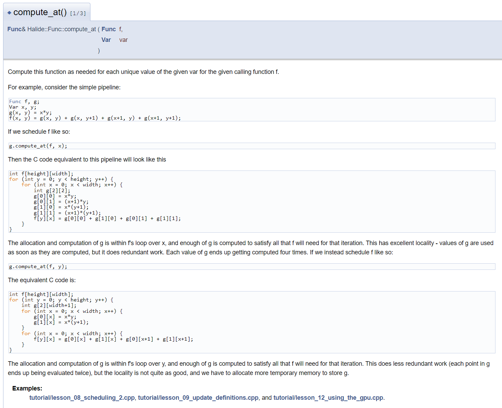
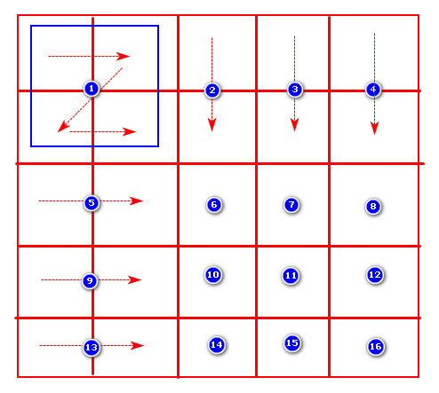
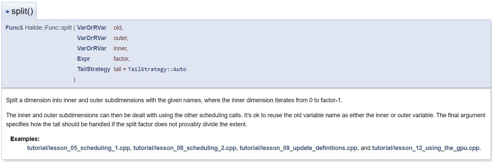

# lesson 8: Scheduling multi-stage pipelines

## Code

- https://halide-lang.org/tutorials/tutorial_lesson_08_scheduling_2.html

## Build & Run
```bash
dongkesi@2020:~/github/Halide/build/distrib/tutorial$ g++ lesson_08*.cpp -g -std=c++11 -I ../include -L ../bin -lHalide -lpthread -ldl -o lesson_08
dongkesi@2020:~/github/Halide/build/distrib/tutorial$ LD_LIBRARY_PATH=../bin ./lesson_08
```
## 代码分析

### Let's examine various scheduling options for a simple two stage pipeline. We'll start with the default schedule:
#### Section 1
```c
{
    Func producer("producer_default"), consumer("consumer_default");

    // The first stage will be some simple pointwise math similar
    // to our familiar gradient function. The value at position x,
    // y is the sin of product of x and y.
    producer(x, y) = sin(x * y);

    // Now we'll add a second stage which averages together multiple
    // points in the first stage.
    consumer(x, y) = (producer(x, y) +
                      producer(x, y+1) +
                      producer(x+1, y) +
                      producer(x+1, y+1))/4;

    // We'll turn on tracing for both functions.
    consumer.trace_stores();
    producer.trace_stores();

    // And evaluate it over a 4x4 box.
    printf("\nEvaluating producer-consumer pipeline with default schedule\n");
    consumer.realize(4, 4);
    // Click to show output ...
```
- Output
```c
// Consumer输出的内容；
Evaluating producer-consumer pipeline with default schedule
Begin pipeline consumer_default.0()
Tag consumer_default.0() tag = "func_type_and_dim: 1 2 32 1 2 0 4 0 4"
Store consumer_default.0(0, 0) = 0.210368
Store consumer_default.0(1, 0) = 0.437692
Store consumer_default.0(2, 0) = 0.262604
Store consumer_default.0(3, 0) = -0.153921
Store consumer_default.0(0, 1) = 0.437692
Store consumer_default.0(1, 1) = 0.475816
Store consumer_default.0(2, 1) = 0.003550
Store consumer_default.0(3, 1) = 0.023565
Store consumer_default.0(0, 2) = 0.262604
Store consumer_default.0(1, 2) = 0.003550
Store consumer_default.0(2, 2) = -0.225879
Store consumer_default.0(3, 2) = 0.146372
Store consumer_default.0(0, 3) = -0.153921
Store consumer_default.0(1, 3) = 0.023565
Store consumer_default.0(2, 3) = 0.146372
Store consumer_default.0(3, 3) = -0.237233
End pipeline consumer_default.0()
```
> 没有关于`producer`计算的消息。这是因为默认计划将`producer`完全内联到`consumer`中。好像我们写了以下代码：
```c
    // There were no messages about computing values of the
    // producer. This is because the default schedule fully
    // inlines 'producer' into 'consumer'. It is as if we had
    // written the following code instead:

    // consumer(x, y) = (sin(x * y) +
    //                   sin(x * (y + 1)) +
    //                   sin((x + 1) * y) +
    //                   sin((x + 1) * (y + 1))/4);

    // All calls to 'producer' have been replaced with the body of
    // 'producer', with the arguments substituted in for the
    // variables.
```
#### Section 2
```c
    // The equivalent C code is:
    float result[4][4];
    for (int y = 0; y < 4; y++) {
        for (int x = 0; x < 4; x++) {
            result[y][x] = (sin(x*y) +
                            sin(x*(y+1)) +
                            sin((x+1)*y) +
                            sin((x+1)*(y+1)))/4;
        }
    }
    printf("\n");
```
#### Section 3
```c
    // If we look at the loop nest, the producer doesn't appear
    // at all. It has been inlined into the consumer.
    printf("Pseudo-code for the schedule:\n");
    consumer.print_loop_nest();
    printf("\n");
    // Click to show output ...
}
```
- Output
```c
Pseudo-code for the schedule:
produce consumer_default:
  for y:
    for x:
      consumer_default(...) = ...
```
### Next we'll examine the next simplest option - computing all values required in the producer before computing any of the consumer. We call this schedule "root".
### Section 1
```c
{
    // Start with the same function definitions:
    Func producer("producer_root"), consumer("consumer_root");
    producer(x, y) = sin(x * y);
    consumer(x, y) = (producer(x, y) +
                      producer(x, y+1) +
                      producer(x+1, y) +
                      producer(x+1, y+1))/4;

    // Tell Halide to evaluate all of producer before any of consumer.
    producer.compute_root();

    // Turn on tracing.
    consumer.trace_stores();
    producer.trace_stores();

    // Compile and run.
    printf("\nEvaluating producer.compute_root()\n");
    consumer.realize(4, 4);
    // Click to show output ...
```
- Output
```c
Evaluating producer.compute_root()
Begin pipeline consumer_root.0()
Tag producer_root.0() tag = "func_type_and_dim: 1 2 32 1 2 0 5 0 5"
Tag consumer_root.0() tag = "func_type_and_dim: 1 2 32 1 2 0 4 0 4"
// 先计算producer
Store producer_root.0(0, 0) = 0.000000
Store producer_root.0(1, 0) = 0.000000
Store producer_root.0(2, 0) = 0.000000
Store producer_root.0(3, 0) = 0.000000
Store producer_root.0(4, 0) = 0.000000
Store producer_root.0(0, 1) = 0.000000
Store producer_root.0(1, 1) = 0.841471
Store producer_root.0(2, 1) = 0.909297
Store producer_root.0(3, 1) = 0.141120
Store producer_root.0(4, 1) = -0.756802
Store producer_root.0(0, 2) = 0.000000
Store producer_root.0(1, 2) = 0.909297
Store producer_root.0(2, 2) = -0.756802
Store producer_root.0(3, 2) = -0.279415
Store producer_root.0(4, 2) = 0.989358
Store producer_root.0(0, 3) = 0.000000
Store producer_root.0(1, 3) = 0.141120
Store producer_root.0(2, 3) = -0.279415
Store producer_root.0(3, 3) = 0.412118
Store producer_root.0(4, 3) = -0.536573
Store producer_root.0(0, 4) = 0.000000
Store producer_root.0(1, 4) = -0.756802
Store producer_root.0(2, 4) = 0.989358
Store producer_root.0(3, 4) = -0.536573
Store producer_root.0(4, 4) = -0.287903
// 再计算consumer
Store consumer_root.0(0, 0) = 0.210368
Store consumer_root.0(1, 0) = 0.437692
Store consumer_root.0(2, 0) = 0.262604
Store consumer_root.0(3, 0) = -0.153921
Store consumer_root.0(0, 1) = 0.437692
Store consumer_root.0(1, 1) = 0.475816
Store consumer_root.0(2, 1) = 0.003550
Store consumer_root.0(3, 1) = 0.023565
Store consumer_root.0(0, 2) = 0.262604
Store consumer_root.0(1, 2) = 0.003550
Store consumer_root.0(2, 2) = -0.225879
Store consumer_root.0(3, 2) = 0.146372
Store consumer_root.0(0, 3) = -0.153921
Store consumer_root.0(1, 3) = 0.023565
Store consumer_root.0(2, 3) = 0.146372
Store consumer_root.0(3, 3) = -0.237233
End pipeline consumer_root.0()
```
- Output

  阅读输出我们可以看到：
  - A) There were stores to producer.
  - B) They all happened before any stores to consumer.
  
  请参见下面的可视化。生产者在左边，消费者在右边。**Store用橙色标记，load用蓝色标记**。

  


### Section 2
```c
    // Equivalent C:

    float result[4][4];

    // Allocate some temporary storage for the producer.
    float producer_storage[5][5];

    // Compute the producer.
    for (int y = 0; y < 5; y++) {
        for (int x = 0; x < 5; x++) {
            producer_storage[y][x] = sin(x * y);
        }
    }

    // Compute the consumer. Skip the prints this time.
    for (int y = 0; y < 4; y++) {
        for (int x = 0; x < 4; x++) {
            result[y][x] = (producer_storage[y][x] +
                            producer_storage[y+1][x] +
                            producer_storage[y][x+1] +
                            producer_storage[y+1][x+1])/4;
        }
    }
```

#### Section 3
请注意，**`consumer`是在一个`4x4` box上进行求值的，因此Halide自动推断`Producer`需要一个`5x5` box**。这与我们在上一课中看到的“边界推断”逻辑相同，它用于检测并避免从输入图像读取超出边界的内容。

如果我们打印循环嵌套，我们将看到与上面C非常相似的东西。
```c
    printf("Pseudo-code for the schedule:\n");
    consumer.print_loop_nest();
    printf("\n");
    // Click to show output ...
}
```
- Output

```c
Pseudo-code for the schedule:
produce producer_root:
  for y:
    for x:
      producer_root(...) = ...
consume producer_root:
  produce consumer_root:
    for y:
      for x:
        consumer_root(...) = ...
```
### Let's compare the two approaches above from a performance      perspective.

```c
// Full inlining (the default schedule):
// - Temporary memory allocated: 0
// - Loads: 0
// - Stores: 16
// - Calls to sin: 64
/* 这段函数计算4x4，所以Stores=16; 但是内部调用了4次producer所以调用sin的次数为4x4x4=64
consumer(x, y) = (producer(x, y) +
                      producer(x, y+1) +
                      producer(x+1, y) +
                      producer(x+1, y+1))/4;
*/
// producer.compute_root():
// - Temporary memory allocated: 25 floats
// - Loads: 64
// - Stores: 41
// - Calls to sin: 25
/*
从以下等价的C代码可以看出，
producer stores=25, call sin = 25
consumer stores=16, load = 4x4x4 = 64
       + stores=41  
    // Compute the producer.
    for (int y = 0; y < 5; y++) {
        for (int x = 0; x < 5; x++) {
            producer_storage[y][x] = sin(x * y);
        }
    }

    // Compute the consumer. Skip the prints this time.
    for (int y = 0; y < 4; y++) {
        for (int x = 0; x < 4; x++) {
            result[y][x] = (producer_storage[y][x] +
                            producer_storage[y+1][x] +
                            producer_storage[y][x+1] +
                            producer_storage[y+1][x+1])/4;
        }
    }
*/
```
这是一个折衷方案。**完整的内联使用最小的临时内存和内存带宽，但做了一大堆冗余的昂贵的数学运算（调用sin）**。它对`producer`的大部分点进行了四次求值。第二个调度`producer.compute_root()`，对`sin`的调用次数最少，但使用了更多的临时内存和更多的内存带宽。

在任何给定的情况下，都很难做出正确的选择。
- 如果你的内存带宽有限，或者没有太多内存（例如，因为你用的是旧手机），那么做冗余计算是有意义的。
- 另一方面，`sin`是昂贵的，所以如果计算有限，那么对`sin`的调用更少，从而会使程序更快。

添加向量化或多核并行性**有利于进行冗余工作**，因为启动多个cpu核**会增加每秒的计算量，但不会增加系统内存带宽或容量**。
- 【所以适合上面的第一种情况，即内联】

### We can make choices in between full inlining and compute_root. Next we'll alternate between computing the producer and consumer on a per-scanline basis:

这个示例使用了`producer.compute_at(consumer, y)`，

- 如果按y维计算，那么对于此代码是`producer`计算完两行然后计算`consumer`一行。
- 如果按x维计算，那么对于此代码是`producer`计算完4个点，然后计算`consumer`中的一个点



#### Section 1
```c
{
    // Start with the same function definitions:
    Func producer("producer_y"), consumer("consumer_y");
    producer(x, y) = sin(x * y);
    consumer(x, y) = (producer(x, y) +
                      producer(x, y+1) +
                      producer(x+1, y) +
                      producer(x+1, y+1))/4;

    // Tell Halide to evaluate producer as needed per y coordinate
    // of the consumer:
    producer.compute_at(consumer, y);

    // This places the code that computes the producer just
    // *inside* the consumer's for loop over y, as in the
    // equivalent C below.

    // Turn on tracing.
    producer.trace_stores();
    consumer.trace_stores();

    // Compile and run.
    printf("\nEvaluating producer.compute_at(consumer, y)\n");
    consumer.realize(4, 4);
    // Click to show output ...

    // See below for a visualization.
```


- Output
  
```c
Evaluating producer.compute_at(consumer, y)
Begin pipeline consumer_y.0()
Tag producer_y.0() tag = "func_type_and_dim: 1 2 32 1 2 0 5 0 5"
Tag consumer_y.0() tag = "func_type_and_dim: 1 2 32 1 2 0 4 0 4"
// Y[0:4, 0:1] -> X[0:3, 0]
Store producer_y.0(0, 0) = 0.000000
Store producer_y.0(1, 0) = 0.000000
Store producer_y.0(2, 0) = 0.000000
Store producer_y.0(3, 0) = 0.000000
Store producer_y.0(4, 0) = 0.000000
Store producer_y.0(0, 1) = 0.000000
Store producer_y.0(1, 1) = 0.841471
Store producer_y.0(2, 1) = 0.909297
Store producer_y.0(3, 1) = 0.141120
Store producer_y.0(4, 1) = -0.756802
Store consumer_y.0(0, 0) = 0.210368
Store consumer_y.0(1, 0) = 0.437692
Store consumer_y.0(2, 0) = 0.262604
Store consumer_y.0(3, 0) = -0.153921
// Y[0:4, 1:2] -> X[0:3, 1]
Store producer_y.0(0, 1) = 0.000000
Store producer_y.0(1, 1) = 0.841471
Store producer_y.0(2, 1) = 0.909297
Store producer_y.0(3, 1) = 0.141120
Store producer_y.0(4, 1) = -0.756802
Store producer_y.0(0, 2) = 0.000000
Store producer_y.0(1, 2) = 0.909297
Store producer_y.0(2, 2) = -0.756802
Store producer_y.0(3, 2) = -0.279415
Store producer_y.0(4, 2) = 0.989358
Store consumer_y.0(0, 1) = 0.437692
Store consumer_y.0(1, 1) = 0.475816
Store consumer_y.0(2, 1) = 0.003550
Store consumer_y.0(3, 1) = 0.023565
// Y[0:4, 2:3] -> X[0:3, 2]
Store producer_y.0(0, 2) = 0.000000
Store producer_y.0(1, 2) = 0.909297
Store producer_y.0(2, 2) = -0.756802
Store producer_y.0(3, 2) = -0.279415
Store producer_y.0(4, 2) = 0.989358
Store producer_y.0(0, 3) = 0.000000
Store producer_y.0(1, 3) = 0.141120
Store producer_y.0(2, 3) = -0.279415
Store producer_y.0(3, 3) = 0.412118
Store producer_y.0(4, 3) = -0.536573
Store consumer_y.0(0, 2) = 0.262604
Store consumer_y.0(1, 2) = 0.003550
Store consumer_y.0(2, 2) = -0.225879
Store consumer_y.0(3, 2) = 0.146372
// Y[0:4, 3:4] -> X[0:3, 3]
Store producer_y.0(0, 3) = 0.000000
Store producer_y.0(1, 3) = 0.141120
Store producer_y.0(2, 3) = -0.279415
Store producer_y.0(3, 3) = 0.412118
Store producer_y.0(4, 3) = -0.536573
Store producer_y.0(0, 4) = 0.000000
Store producer_y.0(1, 4) = -0.756802
Store producer_y.0(2, 4) = 0.989358
Store producer_y.0(3, 4) = -0.536573
Store producer_y.0(4, 4) = -0.287903
Store consumer_y.0(0, 3) = -0.153921
Store consumer_y.0(1, 3) = 0.023565
Store consumer_y.0(2, 3) = 0.146372
Store consumer_y.0(3, 3) = -0.237233
End pipeline consumer_y.0()
```
#### Section 2
```c
    // Reading the log or looking at the figure you should see
    // that producer and consumer alternate on a per-scanline
    // basis. Let's look at the equivalent C:

    float result[4][4];

    // There's an outer loop over scanlines of consumer:
    for (int y = 0; y < 4; y++) {

        // Allocate space and compute enough of the producer to
        // satisfy this single scanline of the consumer. This
        // means a 5x2 box of the producer.
        // 注意这些维度的说法，5x2表示widthxheight; 下面的[2][5]数组
        // [2]表示row->height; [5]表示column->width
        float producer_storage[2][5];
        for (int py = y; py < y + 2; py++) {
            for (int px = 0; px < 5; px++) {
                producer_storage[py-y][px] = sin(px * py);
            }
        }

        // Compute a scanline of the consumer.
        for (int x = 0; x < 4; x++) {
            result[y][x] = (producer_storage[0][x] +
                            producer_storage[1][x] +
                            producer_storage[0][x+1] +
                            producer_storage[1][x+1])/4;
        }
    }

```
#### Section 3
```c
    // Again, if we print the loop nest, we'll see something very
    // similar to the C above.
    printf("Pseudo-code for the schedule:\n");
    consumer.print_loop_nest();
    printf("\n");
    // Click to show output ...
}
```

- Output
  
```c
Pseudo-code for the schedule:
produce consumer_y:
  for y:
    produce producer_y:
      for y:
        for x:
          producer_y(...) = ...
    consume producer_y:
      for x:
        consumer_y(...) = ...
```

此策略的性能特征介于`inline`和`compute root`之间。我们仍然会分配一些临时内存，但`compute root`更少，并且具有更好的局部性（我们在写入后很快从中加载，因此对于较大的图像，值应该仍在缓存中）。我们仍然做一些冗余的工作，但还没有完全内联：

```c
    // producer.compute_at(consumer, y):
    // - Temporary memory allocated: 10 floats -> float producer_storage[2][5];
    // - Loads: 64 -> 4x4x4=64
    // - Stores: 56 -> 2x5x4+4x4=56
    // - Calls to sin: 40 -> 2x5x4=40
```

### We could also say producer.compute_at(consumer, x), but this would be very similar to full inlining (the default schedule). Instead let's distinguish between the loop level at which we allocate storage for producer, and the loop level at which we actually compute it. This unlocks a few optimizations.

我们也可以说`producer.compute_at(consumer, x)`，但这与完全内联（默认调度）非常相似。相反，让我们区分**为producer分配存储的循环级别**和**实际计算存储的循环级别**。这会打开一些优化。

#### Section 1
```c
{
    Func producer("producer_root_y"), consumer("consumer_root_y");
    producer(x, y) = sin(x * y);
    consumer(x, y) = (producer(x, y) +
                      producer(x, y+1) +
                      producer(x+1, y) +
                      producer(x+1, y+1))/4;


    // Tell Halide to make a buffer to store all of producer at
    // the outermost level:
    producer.store_root();
    // ... but compute it as needed per y coordinate of the
    // consumer.
    producer.compute_at(consumer, y);

    producer.trace_stores();
    consumer.trace_stores();

    printf("\nEvaluating producer.store_root().compute_at(consumer, y)\n");
    consumer.realize(4, 4);
    // Click to show output ...

    // See below for a
    // visualization.
```


> 这个例子的代码与上一个示例只多了一句`producer.store_root()`, 从而保存了计算的输出，不用进行冗余计算，当然也增加了内存的使用量
- Output
```c
Evaluating producer.store_root().compute_at(consumer, y)
Begin pipeline consumer_root_y.0()
Tag producer_root_y.0() tag = "func_type_and_dim: 1 2 32 1 2 0 5 0 5"
Tag consumer_root_y.0() tag = "func_type_and_dim: 1 2 32 1 2 0 4 0 4"
// Y[0:4, 0:1] -> X[0:3, 0] 这么表示的时候，Y[i,j], i是x维，i是y维，但是数组表示的时候Y[j][i]，按行存储
Store producer_root_y.0(0, 0) = 0.000000
Store producer_root_y.0(1, 0) = 0.000000
Store producer_root_y.0(2, 0) = 0.000000
Store producer_root_y.0(3, 0) = 0.000000
Store producer_root_y.0(4, 0) = 0.000000
Store producer_root_y.0(0, 1) = 0.000000
Store producer_root_y.0(1, 1) = 0.841471
Store producer_root_y.0(2, 1) = 0.909297
Store producer_root_y.0(3, 1) = 0.141120
Store producer_root_y.0(4, 1) = -0.756802
Store consumer_root_y.0(0, 0) = 0.210368
Store consumer_root_y.0(1, 0) = 0.437692
Store consumer_root_y.0(2, 0) = 0.262604
Store consumer_root_y.0(3, 0) = -0.153921
// Y[0:4, 2] -> X[0:3, 1] 复用 Y[0:4, 1]
Store producer_root_y.0(0, 2) = 0.000000
Store producer_root_y.0(1, 2) = 0.909297
Store producer_root_y.0(2, 2) = -0.756802
Store producer_root_y.0(3, 2) = -0.279415
Store producer_root_y.0(4, 2) = 0.989358
Store consumer_root_y.0(0, 1) = 0.437692
Store consumer_root_y.0(1, 1) = 0.475816
Store consumer_root_y.0(2, 1) = 0.003550
Store consumer_root_y.0(3, 1) = 0.023565
// Y[0:4, 3] -> X[0:3, 2] 复用 Y[0:4, 2]
Store producer_root_y.0(0, 3) = 0.000000
Store producer_root_y.0(1, 3) = 0.141120
Store producer_root_y.0(2, 3) = -0.279415
Store producer_root_y.0(3, 3) = 0.412118
Store producer_root_y.0(4, 3) = -0.536573
Store consumer_root_y.0(0, 2) = 0.262604
Store consumer_root_y.0(1, 2) = 0.003550
Store consumer_root_y.0(2, 2) = -0.225879
Store consumer_root_y.0(3, 2) = 0.146372
// Y[0:4, 4] -> X[0:3, 3] 复用 Y[0:4, 3]
Store producer_root_y.0(0, 4) = 0.000000
Store producer_root_y.0(1, 4) = -0.756802
Store producer_root_y.0(2, 4) = 0.989358
Store producer_root_y.0(3, 4) = -0.536573
Store producer_root_y.0(4, 4) = -0.287903
Store consumer_root_y.0(0, 3) = -0.153921
Store consumer_root_y.0(1, 3) = 0.023565
Store consumer_root_y.0(2, 3) = 0.146372
Store consumer_root_y.0(3, 3) = -0.237233
End pipeline consumer_root_y.0()
```
#### Section 2

阅读日志或查看图示，您应该会看到`producer`和`consumer`再次在每个扫描线的基础上交替。它计算`producer`的`5x2` `box`以满足`consumer`的第一个扫描线，但之后它只计算consumer的每个新扫描线的`5x1` `box`输出！

Halide已经检测到，除了第一个扫描线之外，它可以重用已经存在于我们为`producer`分配的缓冲区中的值。

```c
    // equivalent C:

    float result[4][4];

    // producer.store_root() implies that storage goes here:
    // 可以看出因为要存储过去的值，消耗了太多的内存
    float producer_storage[5][5];

    // There's an outer loop over scanlines of consumer:
    for (int y = 0; y < 4; y++) {

        // Compute enough of the producer to satisfy this scanline
        // of the consumer.
        for (int py = y; py < y + 2; py++) {

            // Skip over rows of producer that we've already
            // computed in a previous iteration.
            if (y > 0 && py == y) continue;

            for (int px = 0; px < 5; px++) {
                producer_storage[py][px] = sin(px * py);
            }
        }

        // Compute a scanline of the consumer.
        for (int x = 0; x < 4; x++) {
            result[y][x] = (producer_storage[y][x] +
                            producer_storage[y+1][x] +
                            producer_storage[y][x+1] +
                            producer_storage[y+1][x+1])/4;
        }
    }
```
#### Section 3
```c
    printf("Pseudo-code for the schedule:\n");
    consumer.print_loop_nest();
    printf("\n");
    // Click to show output ...
```
- Output

```c
Pseudo-code for the schedule:
store producer_root_y:
  produce consumer_root_y:
    for y:
      produce producer_root_y:
        for y:
          for x:
            producer_root_y(...) = ...
      consume producer_root_y:
        for x:
          consumer_root_y(...) = ...
```
#### Section 4

这个策略的性能特点相当不错！除了局部性更好之外，这些数字与`compute root`相似。我们执行的`sin`调用的数量是最小的，并且在存储值之后很快就会加载这些值，因此我们可能会充分利用缓存：让我们看看

```c
// producer.store_root().compute_at(consumer, y):
// - Temporary memory allocated: 10 floats -> 5x5=25 ?  下面会有解释
// - Loads: 64 -> 4x4x4 = 64
// - Stores: 39 -> 1x5x3 + 2x5 + 4x4 =  41 ? 
// - Calls to sin: 25 -> 1x5x3 + 2x5 = 25
```
#### Section 5
请注意，我声明的分配内存量与引用的C代码不匹配。Halide正在引擎盖下执行另一个优化。它将Producer的存储器折叠成一个由两条扫描线组成的循环缓冲区。
```c
    // Equivalent C would actually look like this:

    {
        // Actually store 2 scanlines instead of 5
        float producer_storage[2][5];
        for (int y = 0; y < 4; y++) {
            for (int py = y; py < y + 2; py++) {
                if (y > 0 && py == y) continue;
                for (int px = 0; px < 5; px++) {
                    // Stores to producer_storage have their y coordinate bit-masked.
                    producer_storage[py & 1][px] = sin(px * py);
                }
            }

            // Compute a scanline of the consumer.
            for (int x = 0; x < 4; x++) {
                // Loads from producer_storage have their y coordinate bit-masked.
                result[y][x] = (producer_storage[y & 1][x] +
                                producer_storage[(y+1) & 1][x] +
                                producer_storage[y & 1][x+1] +
                                producer_storage[(y+1) & 1][x+1])/4;
            }
        }
    }
}
```
### We can do even better, by leaving the storage outermost, but moving the computation into the innermost loop:
#### Section 1
```c
{
    Func producer("producer_root_x"), consumer("consumer_root_x");
    producer(x, y) = sin(x * y);
    consumer(x, y) = (producer(x, y) +
                      producer(x, y+1) +
                      producer(x+1, y) +
                      producer(x+1, y+1))/4;


    // Store outermost, compute innermost.
    producer.store_root().compute_at(consumer, x);

    producer.trace_stores();
    consumer.trace_stores();

    printf("\nEvaluating producer.store_root().compute_at(consumer, x)\n");
    consumer.realize(4, 4);
    // Click to show output ...

    // See below for a
    // visualization.
```


- Output
```c
Evaluating producer.store_root().compute_at(consumer, x)
Begin pipeline consumer_root_x.0()
Tag producer_root_x.0() tag = "func_type_and_dim: 1 2 32 1 2 0 5 0 5"
Tag consumer_root_x.0() tag = "func_type_and_dim: 1 2 32 1 2 0 4 0 4"
// 第一行
// Y[0:1, 0:1] -> X[0, 0]
Store producer_root_x.0(0, 0) = 0.000000
Store producer_root_x.0(1, 0) = 0.000000
Store producer_root_x.0(0, 1) = 0.000000
Store producer_root_x.0(1, 1) = 0.841471
Store consumer_root_x.0(0, 0) = 0.210368
// Y[2, 0:1]  -> X[1, 0] 复用 Y[1, 0:1]
Store producer_root_x.0(2, 0) = 0.000000
Store producer_root_x.0(2, 1) = 0.909297
Store consumer_root_x.0(1, 0) = 0.437692
// Y[3, 0:1]  -> X[2, 0] 复用 Y[2, 0:1]
Store producer_root_x.0(3, 0) = 0.000000
Store producer_root_x.0(3, 1) = 0.141120
Store consumer_root_x.0(2, 0) = 0.262604
// Y[4, 0:1]  -> X[3, 0] 复用 Y[3, 0:1]
Store producer_root_x.0(4, 0) = 0.000000
Store producer_root_x.0(4, 1) = -0.756802
Store consumer_root_x.0(3, 0) = -0.153921
// 第二行
// Y[0:1, 2]  -> X[0, 1] 复用 Y[0:1, 1]
Store producer_root_x.0(0, 2) = 0.000000
Store producer_root_x.0(1, 2) = 0.909297
Store consumer_root_x.0(0, 1) = 0.437692
// Y[2, 2]   -> X[1, 1] 复用 Y 当前坐标左上角三个点
Store producer_root_x.0(2, 2) = -0.756802
Store consumer_root_x.0(1, 1) = 0.475816
// Y[3, 2]   -> X[2, 1] 复用 Y 当前坐标左上角三个点
Store producer_root_x.0(3, 2) = -0.279415
Store consumer_root_x.0(2, 1) = 0.003550
// Y[4, 2]   -> X[3, 1] 复用 Y 当前坐标左上角三个点
Store producer_root_x.0(4, 2) = 0.989358
Store consumer_root_x.0(3, 1) = 0.023565

// 第三行
Store producer_root_x.0(0, 3) = 0.000000
Store producer_root_x.0(1, 3) = 0.141120
Store consumer_root_x.0(0, 2) = 0.262604

Store producer_root_x.0(2, 3) = -0.279415
Store consumer_root_x.0(1, 2) = 0.003550

Store producer_root_x.0(3, 3) = 0.412118
Store consumer_root_x.0(2, 2) = -0.225879

Store producer_root_x.0(4, 3) = -0.536573
Store consumer_root_x.0(3, 2) = 0.146372

// 第四行
Store producer_root_x.0(0, 4) = 0.000000
Store producer_root_x.0(1, 4) = -0.756802
Store consumer_root_x.0(0, 3) = -0.153921

Store producer_root_x.0(2, 4) = 0.989358
Store consumer_root_x.0(1, 3) = 0.023565

Store producer_root_x.0(3, 4) = -0.536573
Store consumer_root_x.0(2, 3) = 0.146372

Store producer_root_x.0(4, 4) = -0.287903
Store consumer_root_x.0(3, 3) = -0.237233
End pipeline consumer_root_x.0()
```
#### Section 2
```c
    // You should see that producer and consumer now alternate on
    // a per-pixel basis. Here's the equivalent C:

    float result[4][4];

    // producer.store_root() implies that storage goes here, but
    // we can fold it down into a circular buffer of two
    // scanlines:
    float producer_storage[2][5];

    // For every pixel of the consumer:
    for (int y = 0; y < 4; y++) {
        for (int x = 0; x < 4; x++) {

            // Compute enough of the producer to satisfy this
            // pixel of the consumer, but skip values that we've
            // already computed:
            if (y == 0 && x == 0)
                producer_storage[y & 1][x] = sin(x*y);
            if (y == 0)
                producer_storage[y & 1][x+1] = sin((x+1)*y);
            if (x == 0)
                producer_storage[(y+1) & 1][x] = sin(x*(y+1));
            producer_storage[(y+1) & 1][x+1] = sin((x+1)*(y+1));

            result[y][x] = (producer_storage[y & 1][x] +
                            producer_storage[(y+1) & 1][x] +
                            producer_storage[y & 1][x+1] +
                            producer_storage[(y+1) & 1][x+1])/4;
        }
    }
```


> 以上代码的计算方式如上图，第一次计算，需要计算四个点，然后2,3,4纵向每次计算2个点，5,9,13横向每次计算2个点，其它每次计算一个点
#### Section 3
```c
    printf("Pseudo-code for the schedule:\n");
    consumer.print_loop_nest();
    printf("\n");
    // Click to show output ...
```
- Output

```c
Pseudo-code for the schedule:
store producer_root_x:
  produce consumer_root_x:
    for y:
      for x:
        produce producer_root_x:
          for y:
            for x:
              producer_root_x(...) = ...
        consume producer_root_x:
          consumer_root_x(...) = ...
```
#### Section 4
到目前为止，这种策略的性能特征是最好的。我们需要的`producer`的四个值之一可能**仍然位于寄存器中，因此我不会将其计算为load**：

TODO:
【这一集有点看不懂，代码中列的注释跟我算的对不上呀？】
```c
    // The performance characteristics of this strategy are the
    // best so far. One of the four values of the producer we need
    // is probably still sitting in a register, so I won't count
    // it as a load:
    // producer.store_root().compute_at(consumer, x):
    // - Temporary memory allocated: 10 floats
    // - Loads: 48 -> 4x4x4 = 64 ?
    // - Stores: 56 -> 4x1 + 3x2 + 3x2 + 9x1 + 4x4 = 41?
    // - Calls to sin: 40 -> 4x1 + 3x2 + 3x2 + 9x1 = 25?
```

### Discussion
有什么发现？**为什么不**总是对此类代码执行`producer.store_root().compute_at(consumer, x)`

**答案是并行性**。在前两种策略中，我们都假设在前一次迭代中计算出的值是可以重用的。这假设先前的x或y值在时间上发生得更早并且已经完成。如果并行化或向量化任何一个循环，则这不是真的。该死的。如果并行化，Halide不会注入跳过已经完成的工作的优化，如果在`store_at`和`comput_at`之间有一个并行循环，也不会将存储区折叠成循环缓冲区，这使得我们的`store_root`没有意义。

### Tile
我们没有选择了。我们可以通过分割来制造新的。我们可以`store_at`或`comput_at`消费者的自然变量（x和y），也可以**将x或y拆分为新的内部和外部子变量，然后根据这些子变量进行调度**。我们将用这个来表达tiles的融合：


> 最内部循环是0~factor-1

#### Section 1

```c
{
    Func producer("producer_tile"), consumer("consumer_tile");
    producer(x, y) = sin(x * y);
    consumer(x, y) = (producer(x, y) +
                      producer(x, y+1) +
                      producer(x+1, y) +
                      producer(x+1, y+1))/4;

    // We'll compute 8x8 of the consumer, in 4x4 tiles.
    Var x_outer, y_outer, x_inner, y_inner;
    consumer.tile(x, y, x_outer, y_outer, x_inner, y_inner, 4, 4);

    // Compute the producer per tile of the consumer
    producer.compute_at(consumer, x_outer);

    // Notice that I wrote my schedule starting from the end of
    // the pipeline (the consumer). This is because the schedule
    // for the producer refers to x_outer, which we introduced
    // when we tiled the consumer. You can write it in the other
    // order, but it tends to be harder to read.

    /*
    注意，我从管道的末端（消费者）开始编写我的调度。这是因为producer的
    调度是指 x_outer，这是我们在tiled consumer时引入的。你可以按另一
    个顺序写，但往往更难读。
    */
    // Turn on tracing.
    producer.trace_stores();
    consumer.trace_stores();

    printf("\nEvaluating:\n"
            "consumer.tile(x, y, x_outer, y_outer, x_inner, y_inner, 4, 4);\n"
            "producer.compute_at(consumer, x_outer);\n");
    consumer.realize(8, 8);
    // Click to show output ...

    // See below for a visualization.
```


> 注意图中x=4那一列, 和y=4那一行，在块之间冗余计算了；
> 另外计算的时候，compute_at使用了x_outer参数，即根据函数的定义“根据需要对给定调用函数f的给定var的**每个惟一值**计算这个函数”，所以这里是按图中分块计算的。当算完以整个tile之后才计算了consumer对应的块
- Output
```c
Evaluating:
// 分割成了x, y 的 strip 为4的tile
consumer.tile(x, y, x_outer, y_outer, x_inner, y_inner, 4, 4);
producer.compute_at(consumer, x_outer);
Begin pipeline consumer_tile.0()
Tag producer_tile.0() tag = "func_type_and_dim: 1 2 32 1 2 0 9 0 9"
Tag consumer_tile.0() tag = "func_type_and_dim: 1 2 32 1 2 0 8 0 8"
// Y[0:4, 0:4] -> X[0:3, 0:3]
Store producer_tile.0(0, 0) = 0.000000
Store producer_tile.0(1, 0) = 0.000000
Store producer_tile.0(2, 0) = 0.000000
Store producer_tile.0(3, 0) = 0.000000
Store producer_tile.0(4, 0) = 0.000000
Store producer_tile.0(0, 1) = 0.000000
Store producer_tile.0(1, 1) = 0.841471
Store producer_tile.0(2, 1) = 0.909297
Store producer_tile.0(3, 1) = 0.141120
Store producer_tile.0(4, 1) = -0.756802
Store producer_tile.0(0, 2) = 0.000000
Store producer_tile.0(1, 2) = 0.909297
Store producer_tile.0(2, 2) = -0.756802
Store producer_tile.0(3, 2) = -0.279415
Store producer_tile.0(4, 2) = 0.989358
Store producer_tile.0(0, 3) = 0.000000
Store producer_tile.0(1, 3) = 0.141120
Store producer_tile.0(2, 3) = -0.279415
Store producer_tile.0(3, 3) = 0.412118
Store producer_tile.0(4, 3) = -0.536573
Store producer_tile.0(0, 4) = 0.000000
Store producer_tile.0(1, 4) = -0.756802
Store producer_tile.0(2, 4) = 0.989358
Store producer_tile.0(3, 4) = -0.536573
Store producer_tile.0(4, 4) = -0.287903

Store consumer_tile.0(0, 0) = 0.210368
Store consumer_tile.0(1, 0) = 0.437692
Store consumer_tile.0(2, 0) = 0.262604
Store consumer_tile.0(3, 0) = -0.153921
Store consumer_tile.0(0, 1) = 0.437692
Store consumer_tile.0(1, 1) = 0.475816
Store consumer_tile.0(2, 1) = 0.003550
Store consumer_tile.0(3, 1) = 0.023565
Store consumer_tile.0(0, 2) = 0.262604
Store consumer_tile.0(1, 2) = 0.003550
Store consumer_tile.0(2, 2) = -0.225879
Store consumer_tile.0(3, 2) = 0.146372
Store consumer_tile.0(0, 3) = -0.153921
Store consumer_tile.0(1, 3) = 0.023565
Store consumer_tile.0(2, 3) = 0.146372
Store consumer_tile.0(3, 3) = -0.237233

// Y[4:8, 0:4] -> X[4:7, 0:3]
Store producer_tile.0(4, 0) = 0.000000
Store producer_tile.0(5, 0) = 0.000000
Store producer_tile.0(6, 0) = 0.000000
Store producer_tile.0(7, 0) = 0.000000
Store producer_tile.0(8, 0) = 0.000000
Store producer_tile.0(4, 1) = -0.756802
Store producer_tile.0(5, 1) = -0.958924
Store producer_tile.0(6, 1) = -0.279415
Store producer_tile.0(7, 1) = 0.656987
Store producer_tile.0(8, 1) = 0.989358
Store producer_tile.0(4, 2) = 0.989358
Store producer_tile.0(5, 2) = -0.544021
Store producer_tile.0(6, 2) = -0.536573
Store producer_tile.0(7, 2) = 0.990607
Store producer_tile.0(8, 2) = -0.287903
Store producer_tile.0(4, 3) = -0.536573
Store producer_tile.0(5, 3) = 0.650288
Store producer_tile.0(6, 3) = -0.750987
Store producer_tile.0(7, 3) = 0.836656
Store producer_tile.0(8, 3) = -0.905578
Store producer_tile.0(4, 4) = -0.287903
Store producer_tile.0(5, 4) = 0.912945
Store producer_tile.0(6, 4) = -0.905578
Store producer_tile.0(7, 4) = 0.270906
Store producer_tile.0(8, 4) = 0.551427

Store consumer_tile.0(4, 0) = -0.428932
Store consumer_tile.0(5, 0) = -0.309585
Store consumer_tile.0(6, 0) = 0.094393
Store consumer_tile.0(7, 0) = 0.411586
Store consumer_tile.0(4, 1) = -0.317597
Store consumer_tile.0(5, 1) = -0.579733
Store consumer_tile.0(6, 1) = 0.207901
Store consumer_tile.0(7, 1) = 0.587262
Store consumer_tile.0(4, 2) = 0.139763
Store consumer_tile.0(5, 2) = -0.295323
Store consumer_tile.0(6, 2) = 0.134926
Store consumer_tile.0(7, 2) = 0.158445
Store consumer_tile.0(4, 3) = 0.184689
Store consumer_tile.0(5, 3) = -0.023333
Store consumer_tile.0(6, 3) = -0.137251
Store consumer_tile.0(7, 3) = 0.188352

// Y[0:4, 4:8] -> X[0:3, 4:7]
Store producer_tile.0(0, 4) = 0.000000
Store producer_tile.0(1, 4) = -0.756802
Store producer_tile.0(2, 4) = 0.989358
Store producer_tile.0(3, 4) = -0.536573
Store producer_tile.0(4, 4) = -0.287903
Store producer_tile.0(0, 5) = 0.000000
Store producer_tile.0(1, 5) = -0.958924
Store producer_tile.0(2, 5) = -0.544021
Store producer_tile.0(3, 5) = 0.650288
Store producer_tile.0(4, 5) = 0.912945
Store producer_tile.0(0, 6) = 0.000000
Store producer_tile.0(1, 6) = -0.279415
Store producer_tile.0(2, 6) = -0.536573
Store producer_tile.0(3, 6) = -0.750987
Store producer_tile.0(4, 6) = -0.905578
Store producer_tile.0(0, 7) = 0.000000
Store producer_tile.0(1, 7) = 0.656987
Store producer_tile.0(2, 7) = 0.990607
Store producer_tile.0(3, 7) = 0.836656
Store producer_tile.0(4, 7) = 0.270906
Store producer_tile.0(0, 8) = 0.000000
Store producer_tile.0(1, 8) = 0.989358
Store producer_tile.0(2, 8) = -0.287903
Store producer_tile.0(3, 8) = -0.905578
Store producer_tile.0(4, 8) = 0.551427

Store consumer_tile.0(0, 4) = -0.428932
Store consumer_tile.0(1, 4) = -0.317597
Store consumer_tile.0(2, 4) = 0.139763
Store consumer_tile.0(3, 4) = 0.184689
Store consumer_tile.0(0, 5) = -0.309585
Store consumer_tile.0(1, 5) = -0.579733
Store consumer_tile.0(2, 5) = -0.295323
Store consumer_tile.0(3, 5) = -0.023333
Store consumer_tile.0(0, 6) = 0.094393
Store consumer_tile.0(1, 6) = 0.207901
Store consumer_tile.0(2, 6) = 0.134926
Store consumer_tile.0(3, 6) = -0.137251
Store consumer_tile.0(0, 7) = 0.411586
Store consumer_tile.0(1, 7) = 0.587262
Store consumer_tile.0(2, 7) = 0.158445
Store consumer_tile.0(3, 7) = 0.188352

// Y[4:8, 4:8] -> X[4:7, 4:7]
Store producer_tile.0(4, 4) = -0.287903
Store producer_tile.0(5, 4) = 0.912945
Store producer_tile.0(6, 4) = -0.905578
Store producer_tile.0(7, 4) = 0.270906
Store producer_tile.0(8, 4) = 0.551427
Store producer_tile.0(4, 5) = 0.912945
Store producer_tile.0(5, 5) = -0.132352
Store producer_tile.0(6, 5) = -0.988032
Store producer_tile.0(7, 5) = -0.428183
Store producer_tile.0(8, 5) = 0.745113
Store producer_tile.0(4, 6) = -0.905578
Store producer_tile.0(5, 6) = -0.988032
Store producer_tile.0(6, 6) = -0.991779
Store producer_tile.0(7, 6) = -0.916522
Store producer_tile.0(8, 6) = -0.768255
Store producer_tile.0(4, 7) = 0.270906
Store producer_tile.0(5, 7) = -0.428183
Store producer_tile.0(6, 7) = -0.916522
Store producer_tile.0(7, 7) = -0.953753
Store producer_tile.0(8, 7) = -0.521551
Store producer_tile.0(4, 8) = 0.551427
Store producer_tile.0(5, 8) = 0.745113
Store producer_tile.0(6, 8) = -0.768255
Store producer_tile.0(7, 8) = -0.521551
Store producer_tile.0(8, 8) = 0.920026

Store consumer_tile.0(4, 4) = 0.351409
Store consumer_tile.0(5, 4) = -0.278254
Store consumer_tile.0(6, 4) = -0.512722
Store consumer_tile.0(7, 4) = 0.284816
Store consumer_tile.0(4, 5) = -0.278254
Store consumer_tile.0(5, 5) = -0.775048
Store consumer_tile.0(6, 5) = -0.831129
Store consumer_tile.0(7, 5) = -0.341961
Store consumer_tile.0(4, 6) = -0.512722
Store consumer_tile.0(5, 6) = -0.831129
Store consumer_tile.0(6, 6) = -0.944644
Store consumer_tile.0(7, 6) = -0.790020
Store consumer_tile.0(4, 7) = 0.284816
Store consumer_tile.0(5, 7) = -0.341961
Store consumer_tile.0(6, 7) = -0.790020
Store consumer_tile.0(7, 7) = -0.269207
End pipeline consumer_tile.0()
```
#### Section 2  
```c
    // The producer and consumer now alternate on a per-tile
    // basis. Here's the equivalent C:

    float result[8][8];

    // For every tile of the consumer:
    for (int y_outer = 0; y_outer < 2; y_outer++) {
        for (int x_outer = 0; x_outer < 2; x_outer++) {
            // Compute the x and y coords of the start of this tile.
            int x_base = x_outer*4;
            int y_base = y_outer*4;

            // Compute enough of producer to satisfy this tile. A
            // 4x4 tile of the consumer requires a 5x5 tile of the
            // producer.
            float producer_storage[5][5];
            for (int py = y_base; py < y_base + 5; py++) {
                for (int px = x_base; px < x_base + 5; px++) {
                    producer_storage[py-y_base][px-x_base] = sin(px * py);
                }
            }

            // Compute this tile of the consumer
            for (int y_inner = 0; y_inner < 4; y_inner++) {
                for (int x_inner = 0; x_inner < 4; x_inner++) {
                    int x = x_base + x_inner;
                    int y = y_base + y_inner;
                    result[y][x] =
                        (producer_storage[y - y_base][x - x_base] +
                          producer_storage[y - y_base + 1][x - x_base] +
                          producer_storage[y - y_base][x - x_base + 1] +
                          producer_storage[y - y_base + 1][x - x_base + 1])/4;
                }
            }
        }
    }
```

#### Section 3
对于这样的问题，tile是有意义的，它的stencils在x和y方向向外延伸。每个tile可以**独立地并行计算**，并且**一旦tile足够大，每个tile所做的冗余工作就不会那么糟糕了**。

```c
    printf("Pseudo-code for the schedule:\n");
    consumer.print_loop_nest();
    printf("\n");
    // Click to show output ...
```
- Output
```c
Pseudo-code for the schedule:
produce consumer_tile:
  for y.v1:
    for x.v0:
      produce producer_tile:
        for y:
          for x:
            producer_tile(...) = ...
      consume producer_tile:
        for y.v3 in [0, 3]:
          for x.v2 in [0, 3]:
            consumer_tile(...) = ...
```

### Let's try a mixed strategy that combines what we have done with splitting, parallelizing, and vectorizing. This is one that often works well in practice for large images. If you understand this schedule, then you understand 95% of scheduling in Halide.

#### Section 1

```c
{
    Func producer("producer_mixed"), consumer("consumer_mixed");
    producer(x, y) = sin(x * y);
    consumer(x, y) = (producer(x, y) +
                      producer(x, y+1) +
                      producer(x+1, y) +
                      producer(x+1, y+1))/4;
```
将Consumer的y坐标分割成16条扫描线:



最内部循环是0->16-1

```c
    // Split the y coordinate of the consumer into strips of 16 scanlines:
    Var yo, yi;
    consumer.split(y, yo, yi, 16);
```
y维：使用线程池和任务队列计算strip。x维：向量化
```c
    // Compute the strips using a thread pool and a task queue.
    consumer.parallel(yo);
    // Vectorize across x by a factor of four.
    consumer.vectorize(x, 4);
```

```c
    // Now store the producer per-strip. This will be 17 scanlines
    // of the producer (16+1), but hopefully it will fold down
    // into a circular buffer of two scanlines:
    producer.store_at(consumer, yo);
    // Within each strip, compute the producer per scanline of the
    // consumer, skipping work done on previous scanlines.
    producer.compute_at(consumer, yi);
    // Also vectorize the producer (because sin is vectorizable on x86 using SSE).
    producer.vectorize(x, 4);

    // Let's leave tracing off this time, because we're going to
    // evaluate over a larger image.
    // consumer.trace_stores();
    // producer.trace_stores();

    Buffer<float> halide_result = consumer.realize(160, 160);

    // See below for a visualization.
```

> 每一轮都是17个scanline，其中前两条黄色之后一条蓝色，后面是每一条黄色跟随一条蓝色。
#### Section 2

```c
    // Here's the equivalent (serial) C:

    float c_result[160][160];

    // For every strip of 16 scanlines (this loop is parallel in
    // the Halide version)
    for (int yo = 0; yo < 160/16 + 1; yo++) {

        // 16 doesn't divide 160, so push the last slice upwards
        // to fit within [0, 159] (see lesson 05).
        int y_base = yo * 16;
        if (y_base > 160-16) y_base = 160-16;

        // Allocate a two-scanline circular buffer for the producer
        float producer_storage[2][161];

        // For every scanline in the strip of 16:
        for (int yi = 0; yi < 16; yi++) {
            int y = y_base + yi;

            for (int py = y; py < y+2; py++) {
                // Skip scanlines already computed *within this task*
                if (yi > 0 && py == y) continue;

                // Compute this scanline of the producer in 4-wide vectors
                for (int x_vec = 0; x_vec < 160/4 + 1; x_vec++) {
                    int x_base = x_vec*4;
                    // 4 doesn't divide 161, so push the last vector left
                    // (see lesson 05).
                    if (x_base > 161 - 4) x_base = 161 - 4;
                    // If you're on x86, Halide generates SSE code for this part:
                    int x[] = {x_base, x_base + 1, x_base + 2, x_base + 3};
                    float vec[4] = {sinf(x[0] * py), sinf(x[1] * py),
                                    sinf(x[2] * py), sinf(x[3] * py)};
                    producer_storage[py & 1][x[0]] = vec[0];
                    producer_storage[py & 1][x[1]] = vec[1];
                    producer_storage[py & 1][x[2]] = vec[2];
                    producer_storage[py & 1][x[3]] = vec[3];
                }
            }

            // Now compute consumer for this scanline:
            for (int x_vec = 0; x_vec < 160/4; x_vec++) {
                int x_base = x_vec * 4;
                // Again, Halide's equivalent here uses SSE.
                int x[] = {x_base, x_base + 1, x_base + 2, x_base + 3};
                float vec[] = {
                    (producer_storage[y & 1][x[0]] +
                      producer_storage[(y+1) & 1][x[0]] +
                      producer_storage[y & 1][x[0]+1] +
                      producer_storage[(y+1) & 1][x[0]+1])/4,
                    (producer_storage[y & 1][x[1]] +
                      producer_storage[(y+1) & 1][x[1]] +
                      producer_storage[y & 1][x[1]+1] +
                      producer_storage[(y+1) & 1][x[1]+1])/4,
                    (producer_storage[y & 1][x[2]] +
                      producer_storage[(y+1) & 1][x[2]] +
                      producer_storage[y & 1][x[2]+1] +
                      producer_storage[(y+1) & 1][x[2]+1])/4,
                    (producer_storage[y & 1][x[3]] +
                      producer_storage[(y+1) & 1][x[3]] +
                      producer_storage[y & 1][x[3]+1] +
                      producer_storage[(y+1) & 1][x[3]+1])/4};

                c_result[y][x[0]] = vec[0];
                c_result[y][x[1]] = vec[1];
                c_result[y][x[2]] = vec[2];
                c_result[y][x[3]] = vec[3];
            }

        }
    }
```
#### Section 3
```c
    printf("Pseudo-code for the schedule:\n");
    consumer.print_loop_nest();
    printf("\n");
    // Click to show output ...
```
- Output

```c
Pseudo-code for the schedule:
produce consumer_mixed:
  parallel y.v4:
    store producer_mixed:
      for y.v5 in [0, 15]:
        produce producer_mixed:
          for y:
            for x.x:
              vectorized x.v7 in [0, 3]:
                producer_mixed(...) = ...
        consume producer_mixed:
          for x.x:
            vectorized x.v6 in [0, 3]:
              consumer_mixed(...) = ...
```
#### Section 4
```c
    // Look on my code, ye mighty, and despair!

    // Let's check the C result against the Halide result. Doing
    // this I found several bugs in my C implementation, which
    // should tell you something.
    for (int y = 0; y < 160; y++) {
        for (int x = 0; x < 160; x++) {
            float error = halide_result(x, y) - c_result[y][x];
            // It's floating-point math, so we'll allow some slop:
            if (error < -0.001f || error > 0.001f) {
                printf("halide_result(%d, %d) = %f instead of %f\n",
                        x, y, halide_result(x, y), c_result[y][x]);
                return -1;
            }
        }
    }

}
```