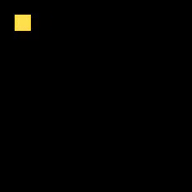
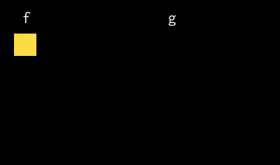

# lesson 17: Reductions over non-rectangular domains

本课程演示了如何使用谓词(predicates)定义迭代在reduction域子集上的更新。

https://halide-lang.org/tutorials/tutorial_lesson_17_predicated_rdom.html

## Build & Run

```bash
dongkesi@2020:~/github/Halide/build/distrib/tutorial$ g++ lesson_17*.cpp -g -I ../include -L ../bin -lHalide -lpthread -ldl -o lesson_17 -std=c++11
dongkesi@2020:~/github/Halide/build/distrib/tutorial$ LD_LIBRARY_PATH=../bin ./lesson_17
```

## 代码分析
### RDom::where directive
#### Section 1
在第9课中，我们学习了如何使用RDom定义要在Halide更新定义中使用的“readuction domain”。 但是，由`RDom`定义的域始终是**矩形**的，并且更新发生在该矩形域的每个点上。在某些情况下，我们可能要遍历某些非矩形域，例如 一个圆圈。我们可以通过使用`RDom::where`指令来实现此行为。
```c
{
    // Starting with this pure definition:
    Func circle("circle");
    Var x("x"), y("y");
    circle(x, y) = x + y;
```
假设我们要进行更新，以对以`(3, 3)`为中心，半径为`3`的**圆形**区域内的值进行平方。为此，我们首先使用`RDom`在圆形区域上定义最小边界框。
```c
    // Say we want an update that squares the values inside a
    // circular region centered at (3, 3) with radius of 3. To do
    // this, we first define the minimal bounding box over the
    // circular region using an RDom.
    RDom r(0, 7, 0, 7);
```
边界框不必最小。实际上，该框可以是任何尺寸，**只要它能覆盖我们要更新的区域**即可。但是，边界框越紧密，生成的循环边界就越紧密。Halide会在可能的情况下自动收紧循环边界，但通常**最好定义一个最小的边界框**。

然后，我们使用`RDom::where`在该边界框上**定义谓词（predicate）**，以便仅在给定谓词的值为真（即在圆形区域内）时才执行更新。
```c
    // The bounding box does not have to be minimal. In fact, the
    // box can be of any size, as long it covers the region we'd
    // like to update. However, the tighter the bounding box, the
    // tighter the generated loop bounds will be. Halide will
    // tighten the loop bounds automatically when possible, but in
    // general, it is better to define a minimal bounding box.

    // Then, we use RDom::where to define the predicate over that
    // bounding box, such that the update is performed only if the
    // given predicate evaluates to true, i.e. within the circular
    // region.
    r.where((r.x - 3)*(r.x - 3) + (r.y - 3)*(r.y - 3) <= 10);
```
定义谓词后，然后定义更新。
```c
    // After defining the predicate, we then define the update.
    circle(r.x, r.y) *= 2;

    Buffer<int> halide_result = circle.realize(7, 7);

    // See below for a visualization of
    // what this did.
```


#### Section 2
```c
    // The equivalent C is:
    int c_result[7][7];
    for (int y = 0; y < 7; y++) {
        for (int x = 0; x < 7; x++) {
            c_result[y][x] = x + y;
        }
    }
    for (int r_y = 0; r_y < 7; r_y++) {
        for (int r_x = 0; r_x < 7; r_x++) {
            // Update is only performed if the predicate evaluates to true.
            if ((r_x - 3)*(r_x - 3) + (r_y - 3)*(r_y - 3) <= 10) {
                c_result[r_y][r_x] *= 2;
            }
        }
    }
```
```c
    // Check the results match:
    for (int y = 0; y < 7; y++) {
        for (int x = 0; x < 7; x++) {
            if (halide_result(x, y) != c_result[y][x]) {
                printf("halide_result(%d, %d) = %d instead of %d\n",
                        x, y, halide_result(x, y), c_result[y][x]);
                return -1;
            }
        }
    }
}
```

### Multiple predicate over an RDom
#### Section 1
我们还可以在RDom上定义多个谓词。假设现在我们希望更新发生在某个三角形区域内。为此，我们定义了三个谓词，每个谓词对应于三角形的一侧。
```c
{
    // We can also define multiple predicates over an RDom. Let's
    // say now we want the update to happen within some triangular
    // region. To do this we define three predicates, where each
    // corresponds to one side of the triangle.
    Func triangle("triangle");
    Var x("x"), y("y");
    triangle(x, y) = x + y;
```
首先，让我们在三角形区域上定义最小边界框。
```c
    // First, let's define the minimal bounding box over the triangular
    // region.
    RDom r(0, 8, 0, 10);
```
接下来，让我们使用对`RDom::where`的多次调用将三个谓词添加到RDom中。
```c
    // Next, let's add the three predicates to the RDom using
    // multiple calls to RDom::where
    r.where(r.x + r.y > 5);
    r.where(3*r.y - 2*r.x < 15);
    r.where(4*r.x - r.y < 20);
```
我们还可以像这样将多个谓词打包在一起：
```c
    // We can also pack the multiple predicates into one like so:
    // r.where((r.x + r.y > 5) && (3*r.y - 2*r.x < 15) && (4*r.x - r.y < 20));
```
然后定义更新
```c
    // Then define the update.
    triangle(r.x, r.y) *= 2;

    Buffer<int> halide_result = triangle.realize(10, 10);

    // See below for a
    // visualization of what this did.
```


#### Section 2
```c
    // The equivalent C is:
    int c_result[10][10];
    for (int y = 0; y < 10; y++) {
        for (int x = 0; x < 10; x++) {
            c_result[y][x] = x + y;
        }
    }
    for (int r_y = 0; r_y < 10; r_y++) {
        for (int r_x = 0; r_x < 8; r_x++) {
            // Update is only performed if the predicate evaluates to true.
            if ((r_x + r_y > 5) && (3*r_y - 2*r_x < 15) && (4*r_x - r_y < 20)) {
                c_result[r_y][r_x] *= 2;
            }
        }
    }
```
```c
    // Check the results match:
    for (int y = 0; y < 10; y++) {
        for (int x = 0; x < 10; x++) {
            if (halide_result(x, y) != c_result[y][x]) {
                printf("halide_result(%d, %d) = %d instead of %d\n",
                        x, y, halide_result(x, y), c_result[y][x]);
                return -1;
            }
        }
    }
}
```

### Func predicate

#### Section 1

谓词不仅限于`RDom`的变量`(r.x，r.y，...)`。它也可以在更新定义中引用可用变量，甚至可以调用其他Func，或递归调用同一Func。 例如：
```c
{
    // The predicate is not limited to the RDom's variables only
    // (r.x, r.y, ...).  It can also refer to free variables in
    // the update definition, and even make calls to other Funcs,
    // or make recursive calls to the same Func. For example:
    Func f("f"), g("g");
    Var x("x"), y("y");
    f(x, y) = 2 * x + y;
    g(x, y) = x + y;
```
RDom的谓词取决于“f”的初始值。
```c
    // This RDom's predicates depend on the initial value of 'f'.
    RDom r1(0, 5, 0, 5);
    r1.where(f(r1.x, r1.y) >= 4);
    r1.where(f(r1.x, r1.y) <= 7);
    f(r1.x, r1.y) /= 10;

    f.compute_root();
```
这涉及到另一个Func的调用。
```c
    // While this one involves calls to another Func.
    RDom r2(1, 3, 1, 3);
    r2.where(f(r2.x, r2.y) < 1);
    g(r2.x, r2.y) += 17;

    Buffer<int> halide_result_g = g.realize(5, 5);

    // See below for a
    // visualization of what this did.
```



#### Section 2
```c
    // The equivalent C for 'f' is:
    int c_result_f[5][5];
    for (int y = 0; y < 5; y++) {
        for (int x = 0; x < 5; x++) {
            c_result_f[y][x] = 2 * x + y;
        }
    }
    for (int r1_y = 0; r1_y < 5; r1_y++) {
        for (int r1_x = 0; r1_x < 5; r1_x++) {
            // Update is only performed if the predicate evaluates to true.
            if ((c_result_f[r1_y][r1_x] >= 4) && (c_result_f[r1_y][r1_x] <= 7)) {
                c_result_f[r1_y][r1_x] /= 10;
            }
        }
    }

    // And, the equivalent C for 'g' is:
    int c_result_g[5][5];
    for (int y = 0; y < 5; y++) {
        for (int x = 0; x < 5; x++) {
            c_result_g[y][x] = x + y;
        }
    }
    for (int r2_y = 1; r2_y < 4; r2_y++) {
        for (int r1_x = 1; r1_x < 4; r1_x++) {
            // Update is only performed if the predicate evaluates to true.
            if (c_result_f[r2_y][r1_x] < 1) {
                c_result_g[r2_y][r1_x] += 17;
            }
        }
    }
```

```c
    // Check the results match:
    for (int y = 0; y < 5; y++) {
        for (int x = 0; x < 5; x++) {
            if (halide_result_g(x, y) != c_result_g[y][x]) {
                printf("halide_result_g(%d, %d) = %d instead of %d\n",
                        x, y, halide_result_g(x, y), c_result_g[y][x]);
                return -1;
            }
        }
    }
}
```
