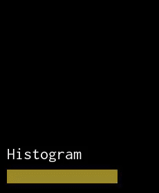
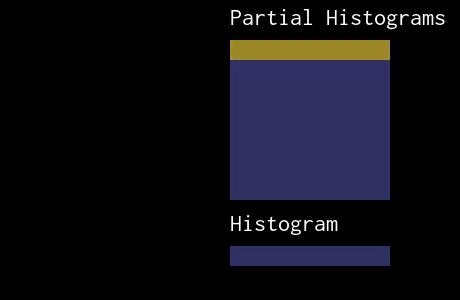

# lesson 18: Factoring an associative reduction using rfactor

本课演示如何使用调度指令“rfactor”并行化或向量化`associative reduction`。

## Build & Run
```bash
dongkesi@2020:~/github/Halide/build/distrib/tutorial$ g++ lesson_18*.cpp -g -I ../include -L ../bin -lHalide -lpthread -ldl -o lesson_18 -std=c++11
dongkesi@2020:~/github/Halide/build/distrib/tutorial$ LD_LIBRARY_PATH=../bin ./lesson_18
```
## 代码分析
### Declare
```c
#include "Halide.h"
#include <stdio.h>

using namespace Halide;

int main(int argc, char **argv) {
    // Declare some Vars to use below.
    Var x("x"), y("y"), i("i"), u("u"), v("v");

    // Create an input with random values.
    Buffer<uint8_t> input(8, 8, "input");
    for (int y = 0; y < 8; ++y) {
        for (int x = 0; x < 8; ++x) {
            input(x, y) = (rand() % 256);
        }
    }
```
### Review 
#### Section 1
如先前在第9课中所述，并行化属于`reduction domain`的变量非常棘手，因为这些变量之间可能存在数据相关性。考虑第9课中的直方图示例：
```c
{
    // As mentioned previously in lesson 9, parallelizing variables that
    // are part of a reduction domain is tricky, since there may be data
    // dependencies across those variables.

    // Consider the histogram example in lesson 9:
    Func histogram("hist_serial");
    histogram(i) = 0;
    RDom r(0, input.width(), 0, input.height());
    histogram(input(r.x, r.y) / 32) += 1;

    histogram.vectorize(i, 8);
    histogram.realize(8);

    // See below for a visualization of
    // what this does.
```


我们可以向量化直方图存储区的初始化，但是由于更新定义中`r.x`和`r.y`之间存在数据相关性（即更新是指上一次迭代中计算出的值），因此如果不引入`r.x`或`r.y` 竞争条件，就**无法并行化或向量化**。 以下代码将产生错误：histogram.update().parallel(r.y);

```c
    // We can vectorize the initialization of the histogram
    // buckets, but since there are data dependencies across r.x
    // and r.y in the update definition (i.e. the update refers to
    // value computed in the previous iteration), we can't
    // parallelize or vectorize r.x or r.y without introducing a
    // race condition. The following code would produce an error:
    // histogram.update().parallel(r.y);
}
```
### Slice

但是请注意，直方图运算（这是`sum reduction`的一种）是关联的。 加速关联归约的一个常见技巧是**将归约域切成较小的片，在每个片上计算部分结果，然后合并结果**。由于每个切片的计算是独立的，因此我们**可以并行化切片**。

回到直方图示例，我们通过定义一个中间函数来将归约域切成行，该**中间函数独立地计算每一行的直方图**：

```c
{
    // Note, however, that the histogram operation (which is a
    // kind of sum reduction) is associative. A common trick to
    // speed-up associative reductions is to slice up the
    // reduction domain into smaller slices, compute a partial
    // result over each slice, and then merge the results. Since
    // the computation of each slice is independent, we can
    // parallelize over slices.

    // Going back to the histogram example, we slice the reduction
    // domain into rows by defining an intermediate function that
    // computes the histogram of each row independently:

    Func intermediate("intm_par_manual");
    intermediate(i, y) = 0;
    RDom rx(0, input.width());
    intermediate(input(rx, y) / 32, y) += 1;
```
然后，我们定义第二阶段，将这些部分结果相加：
```c
    // We then define a second stage which sums those partial
    // results:
    Func histogram("merge_par_manual");
    histogram(i) = 0;
    RDom ry(0, input.height());
    histogram(i) += intermediate(i, ry);
```
由于中间代码在`y`维度上不具有数据依赖性，因此我们可以在`y`维上并行化它：
```c
    // Since the intermediate no longer has data dependencies
    // across the y dimension, we can parallelize it over y:
    intermediate.compute_root().update().parallel(y);

    // We can also vectorize the initializations.
    intermediate.vectorize(i, 8);
    histogram.vectorize(i, 8);

    histogram.realize(8);

    // See below for a visualization of
    // what this does.
}
```


